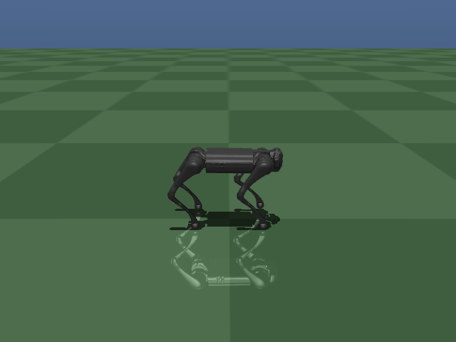
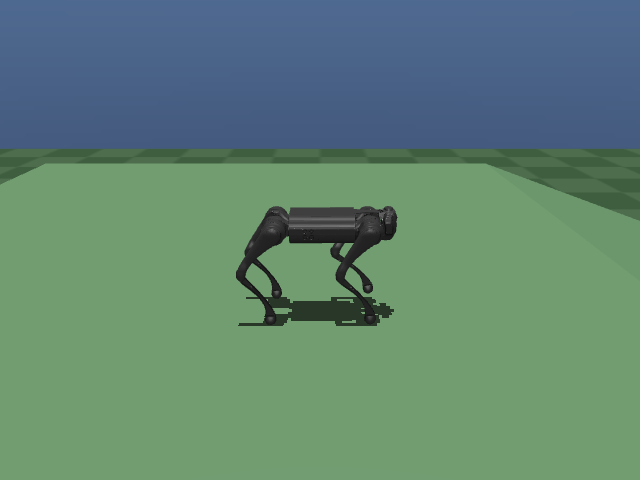
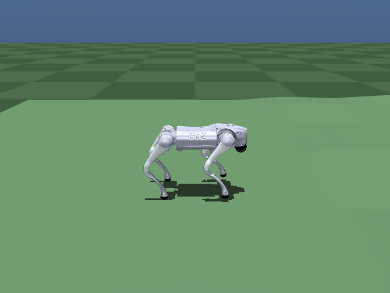
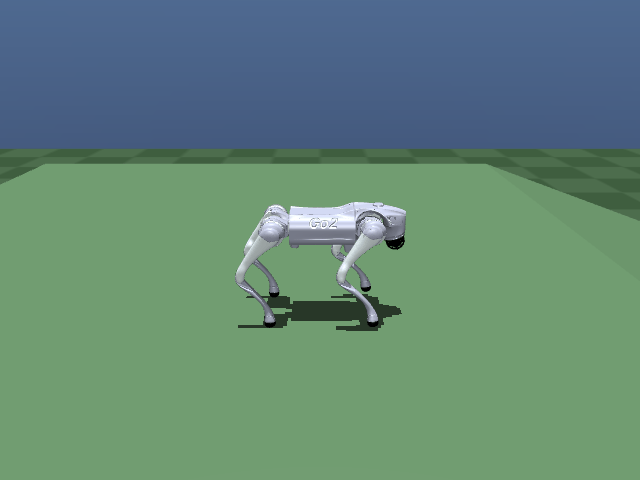
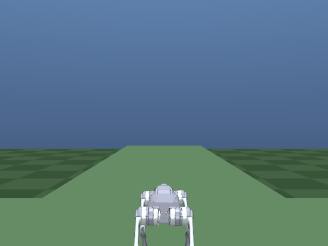
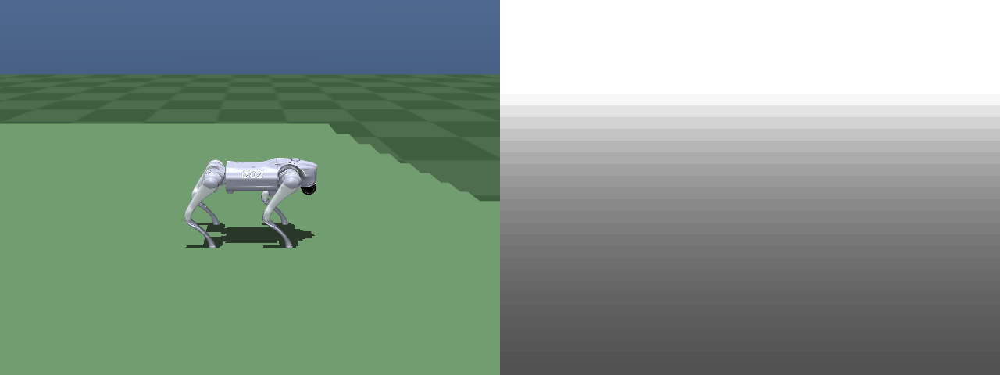
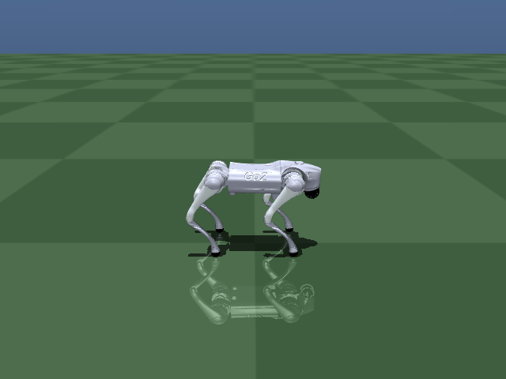
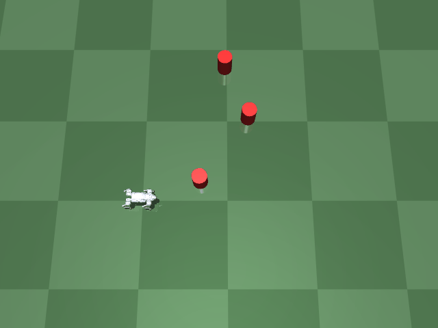
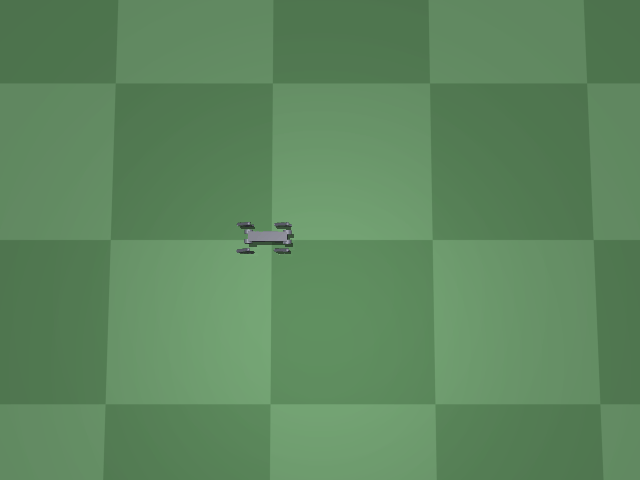

# Full Development History

This is the complete, chronological, stage-by-stage development log for this
project — every reward-shaping decision, every bug found and fixed, every
experiment that failed and why, with real numbers from real logged runs
throughout. It's the detailed appendix behind [README.md](README.md)'s
showcase-level summary.

If you just want to know what this project does and how to run it, read
[README.md](README.md) instead — this document is for understanding *why*
things are the way they are, or for extending the project yourself.

See also [PPO_AND_PROJECT_JOURNEY.md](PPO_AND_PROJECT_JOURNEY.md) for the
PPO/reward-design narrative (a different companion piece, written earlier
and focused on methodology rather than chronology; some overlap with the
early stages here is expected).

---

## How this was trained

`train.py --help` lists every flag, grouped (run bookkeeping, PPO/exploration,
physics/control, command speed, gait clock, reward shaping, terrain, domain
randomization). Rather than guessing a combination from scratch, this is the
actual staged recipe that produced `runs/k_hardmine`, each stage `--resume`ing
the last. Exact flags for any past run are also always in that run's
`runs/<name>/args.json`.

**Stage 1a — flat, fixed 0.3 m/s, diagonal trot clock** (`runs/h_clock`, 6M
steps, ~15 min):
```bash
python train.py --run-name my_h_clock --timesteps 6000000 --n-envs 8 \
    --target-speed 0.3 --kp 80 --kd 2 --log-std-init -1.0 \
    --air-time-cap --air-time-weight 1.0 --foot-clearance-weight 0.3 \
    --phase-match-weight 0.5 --phase-match-warmup-steps 1000000 \
    --gait-period 0.7 --gait-style trot
```

**Stage 1b — speed curriculum, 0.2-1.0 m/s** (`runs/i_speed_curriculum`, +12M
steps, ~70 min):
```bash
python train.py --run-name my_speed --n-envs 16 --timesteps 12000000 \
    --resume runs/my_h_clock/checkpoints/go1_flat_final_*.zip \
    --resume-log-std -1.6 --learning-rate 2e-4 \
    --speed-range-min 0.2 --speed-range-max 1.0 \
    --speed-curriculum-start 0.3 --speed-curriculum-steps 8000000 \
    --gait-period 0.7 --gait-period-fast 0.45 --gait-style trot \
    --phase-match-weight 0.5 --phase-match-warmup-steps 1000000 \
    --lateral-tracking-weight 0.5 --body-frame-velocity \
    --kp 80 --kd 2 --air-time-cap --air-time-weight 1.0 --foot-clearance-weight 0.3
```

**Stage 2a — rough terrain, 0-12 cm heightfield** (`runs/j_terrain`, +14M
steps, ~1.6 h):
```bash
python train.py --run-name my_terrain --n-envs 16 --timesteps 14000000 \
    --resume runs/my_speed/checkpoints/go1_flat_final_*.zip \
    --resume-log-std -1.8 --learning-rate 2e-4 \
    --terrain-amp-max 0.12 --terrain-curriculum-start 0.04 --terrain-curriculum-steps 8000000 \
    --friction-range 0.5 1.25 --mass-scale-range 0.9 1.1 --push-velocity 0.3 \
    --speed-range-min 0.2 --speed-range-max 1.0 --speed-curriculum-start 1.0 --speed-curriculum-steps 1 \
    --gait-period 0.7 --gait-period-fast 0.45 --gait-style trot \
    --phase-match-weight 0.5 --phase-match-warmup-steps 1 \
    --lateral-tracking-weight 0.5 --body-frame-velocity \
    --kp 80 --kd 2 --air-time-cap --air-time-weight 1.0 --foot-clearance-weight 0.3
```

**Stage 2b — hard-mine the worst corner** (`runs/k_hardmine`, +8M steps, ~55
min): the curriculum above only ramps the terrain amplitude's *upper* bound,
so episodes keep sampling amplitude from `U(0, 12cm)` even late in training —
the truly hard combination (large bumps at high speed together) stays a thin
slice of what the policy ever sees. Fine-tune with the sampling biased
directly at the hard region instead of widening the curriculum further:
```bash
python train.py --run-name my_hardmine --n-envs 16 --timesteps 8000000 \
    --resume runs/my_terrain/checkpoints/go1_flat_final_*.zip \
    --resume-log-std -1.8 --learning-rate 1.5e-4 \
    --terrain-amp-min 0.06 --terrain-amp-max 0.12 --terrain-curriculum-start 0.12 --terrain-curriculum-steps 1 \
    --speed-range-min 0.5 --speed-range-max 1.0 --speed-curriculum-start 1.0 --speed-curriculum-steps 1 \
    --friction-range 0.5 1.25 --mass-scale-range 0.9 1.1 --push-velocity 0.3 \
    --gait-period 0.7 --gait-period-fast 0.45 --gait-style trot \
    --phase-match-weight 0.5 --phase-match-warmup-steps 1 \
    --lateral-tracking-weight 0.5 --body-frame-velocity \
    --kp 80 --kd 2 --air-time-cap --air-time-weight 1.0 --foot-clearance-weight 0.3
```

**Stage 3a — slopes.** The actual result (`runs/o_slope_consolidate`) took
4 chained fine-tunes from `k_hardmine`, not one step — `l_slopes` (14M
steps, introduced the slope curriculum, but regressed flat-ground drift and
gait symmetry once it reached its hardest angle) → `m_slope_hardmine` (+8M,
hard-mined the hard region, fixed the drift but only partly fixed the
symmetry) → `n_slope_steep_hardmine` (+10M, narrowed further, fixed some
angles and broke others — 3rd occurrence of narrow hard-mining trading one
corner's quality for another's) → `o_slope_consolidate` (+12M, a single
broad pass: full ranges, no narrowing, less reopened exploration noise —
this is what finally gave a clean win on every metric at once). See
[Stage 3: slopes and stairs](#stage-3-slopes-and-stairs) for the full story.
**Untested shortcut:** if starting fresh, the broad-pass command below run
directly from `k_hardmine` for more steps (order 40M+, matching the total
above) would be worth trying before repeating the narrow intermediate
steps — but this hasn't actually been verified as a substitute for the real
chain, so don't assume it reproduces the same result:
```bash
python train.py --run-name my_slopes --n-envs 16 --timesteps 12000000 \
    --resume pretrained/k_hardmine/checkpoints/go1_flat_final.zip \
    --resume-log-std -2.0 --learning-rate 1.2e-4 \
    --speed-range-min 0.2 --speed-range-max 1.0 --speed-curriculum-start 1.0 --speed-curriculum-steps 1 \
    --terrain-amp-min 0.0 --terrain-amp-max 0.12 --terrain-curriculum-start 0.12 --terrain-curriculum-steps 1 \
    --slope-min-deg 0 --slope-max-deg 20 --slope-curriculum-start 20 --slope-curriculum-steps 1 --ramp-length 8.0 \
    --friction-range 0.5 1.25 --mass-scale-range 0.9 1.1 --push-velocity 0.3 \
    --gait-period 0.7 --gait-period-fast 0.45 --gait-style trot \
    --phase-match-weight 0.5 --phase-match-warmup-steps 1 \
    --lateral-tracking-weight 0.7 --body-frame-velocity \
    --kp 80 --kd 2 --air-time-cap --air-time-weight 1.0 --foot-clearance-weight 0.3
```

**Stage 3b — stairs** (`runs/p_stairs`, resumed from `o_slope_consolidate`,
14M steps): every axis kept at its full existing range from the start —
narrowing while introducing a new axis reliably eroded other capabilities in
stage 3a, so this stage deliberately didn't repeat that mistake:
```bash
python train.py --run-name my_stairs --n-envs 16 --timesteps 14000000 \
    --resume pretrained/o_slope_consolidate/checkpoints/go1_flat_final.zip \
    --resume-log-std -1.8 --learning-rate 2e-4 \
    --speed-range-min 0.2 --speed-range-max 1.0 --speed-curriculum-start 1.0 --speed-curriculum-steps 1 \
    --terrain-amp-min 0.0 --terrain-amp-max 0.12 --terrain-curriculum-start 0.12 --terrain-curriculum-steps 1 \
    --slope-min-deg 0 --slope-max-deg 20 --slope-curriculum-start 20 --slope-curriculum-steps 1 --ramp-length 8.0 \
    --stair-height-min 0.0 --stair-height-max 0.12 --stair-curriculum-start 0.0 --stair-curriculum-steps 8000000 \
    --stair-depth 0.25 --num-stairs 8 \
    --friction-range 0.5 1.25 --mass-scale-range 0.9 1.1 --push-velocity 0.3 \
    --gait-period 0.7 --gait-period-fast 0.45 --gait-style trot \
    --phase-match-weight 0.5 --phase-match-warmup-steps 1 \
    --lateral-tracking-weight 0.7 --body-frame-velocity \
    --kp 80 --kd 2 --air-time-cap --air-time-weight 1.0 --foot-clearance-weight 0.3
```

Monitor any of these with `tensorboard --logdir runs` (`rollout/ep_len_mean`
climbing to 1000 = full-length episodes; `reward_components/*` breaks the
total down by term; `curriculum/*` shows the speed/terrain ramps).

## Current status

16-64 randomized 20 s episodes per cell, deterministic policy, `runs/k_hardmine`:

| Terrain amplitude | Falls @ 0.3 m/s | Falls @ 0.8 m/s | Falls @ 1.0 m/s |
|---|---|---|---|
| flat (0 cm) | 0% | 0% | — |
| 4 cm | 0% | 0% | — |
| 8 cm | 0% | 0% | — |
| 12 cm | 0% | 0% | 0% |

Speed tracking holds within ~5-10% of every commanded speed at every
amplitude; the trot stays symmetric (all four feet at the same step rate and
duty cycle) throughout, with swing height rising automatically on rougher
terrain (6-10 cm on flat ground vs. 14-22 cm on 12 cm terrain at 0.8 m/s).

Getting here took several false starts worth knowing about if you're
extending this:
- **gSDE exploration nearly killed RL entirely.** Its effective noise
  (`std × 128-dim latent features`) toppled an untrained policy in ~0.7 s,
  so the first PPO runs only ever learned to lunge and fall. `train.py`
  now defaults to plain Gaussian noise, off by default (`--no-use-sde`).
- **A fixed gait-timing clock at full strength from step 0 makes things
  worse, not better** — it demands precisely-timed lifts before the policy
  can balance at all. Ramp it in instead (`--phase-match-warmup-steps`).
- **An uncapped air-time reward let one leg hover for 457 ms** and out-earn
  several correct steps elsewhere, causing a lopsided gait where front legs
  stepped twice as often as rear. Fixed by `--air-time-cap`.
- **Reward-shaping weights can be gamed.** A heavier trot-symmetry weight,
  tried alongside other shaping changes, converged to a hobble on a single
  diagonal pair (one pair almost always down, the other almost always up) —
  it satisfied the letter of "diagonal pairs alternate" without producing a
  real trot.
- **A terrain curriculum that only ramps the amplitude's upper bound
  under-trains the hardest corner** even after the ramp finishes, since
  sampling is still uniform from 0. Fixed with a `--terrain-amp-min`
  hard-mining fine-tune once the full curriculum has already run.

## Stage 3: slopes, stairs, and discrete obstacles

Both reuse the rough-terrain heightfield end to end (same spawn-safety lift,
terrain-relative height/contact/termination) — see `Go1FlatEnv._generate_terrain`.
A slope is a flat pad, then a constant grade over a configurable run, then a
flat plateau (`--slope-min-deg`/`--slope-max-deg`/`--ramp-length`). Stairs are
the same shape with a step function instead of a ramp (`--stair-height-min`/
`--stair-height-max`/`--stair-depth`/`--num-stairs`); both directions
("uphill"/"downhill", "ascending"/"descending") are represented by which end
of the pad is elevated, since a MuJoCo heightfield can't go below its own
z=0 plane. **Known approximation:** a heightfield can only change height
within one 5 cm grid cell, so a stair riser is a steep ramp (~63° for a
12 cm step), not a true vertical face.

**Results, `runs/p_stairs`** (resumed from `runs/o_slope_consolidate`, full
0.2-1.0 m/s / 0-12 cm terrain / 0-20° slope / 0-12 cm stairs ranges, all kept
at their full extent rather than narrowed — see the whack-a-mole note below):

| | Falls |
|---|---|
| Slopes alone, ±20°, flat ground | 0% |
| Slopes + 12 cm rough terrain, ±20° | 0-6% |
| Stairs alone, ≤6 cm, either direction | 0% |
| Stairs alone, 12 cm ascending | 6% falls, but see the limitation below |
| Stairs alone, 12 cm descending | 31% |
| Descending 12 cm stairs + any steep downhill slope | ~100% (an extreme, rarely-occurring compound corner) |

**Known limitation, accepted after four different fixes all failed the same
way: ascending stairs above ~8 cm.** Fall rate alone is misleading here — the
robot mostly doesn't fall, it gets physically *stuck*, planting itself at the
first or second step and making no further forward progress regardless of
which fix was tried (confirmed by a user manually testing 12 cm ascending
stairs, then traced numerically: trunk x-position plateaus at ~1.8-1.9 m and
oscillates there for the rest of the episode; visually confirmed in a GIF).
Four structurally different fixes were tried, in this order, each building on
the last (`runs/p_stairs` -> `t_heightmap` -> `u_stair_static`):

1. **Missing incentive**: the foot-clearance reward capped its benefit at a
   fixed 4 cm lift regardless of the actual obstacle (median swing height was
   only 6.6 cm on a 12 cm riser). Fixed with a per-episode adaptive target
   (`_episode_target_clearance = max(target_clearance, stair_h + 0.03)`) —
   confirmed correctly active. No change to the stuck behavior.
2. **Missing time**: the trot clock enforces a fixed ~0.3 s swing regardless
   of what's underfoot. Added `--gait-period-stair-stretch` to slow the clock
   on tall steps (mirrors how `--gait-period-fast` already speeds it up for
   higher commanded speed) — confirmed correctly stretching the period. No
   change; speed also measurably degraded starting around 8 cm even before
   either fix (0.35 m/s at 8 cm vs. a 0.5 m/s command) — a pre-existing
   pattern, not something either fix introduced.
3. **Missing information**: the policy is blind (no exteroception), so it
   can't anticipate a tall step before touching it, unlike a slope (whose
   grade gives an advance tilt cue through gravity sensing). Added
   `--use-terrain-heightmap` (see below) and fine-tuned from a warm-started
   checkpoint. Result was genuine but double-edged: speed at moderate
   heights improved measurably (6 cm 0.448→0.512 m/s, 8 cm 0.352→0.454,
   10 cm 0.146→0.204), but at 12 cm specifically the fall rate got *worse*
   (≈5%→46% — it tries harder and fails outright more often instead of
   safely stalling), and the core stuck-at-the-same-position behavior was
   unchanged.
4. **Rigid gait pattern**: the trot's always-≥2-feet-down diagonal pattern
   might not allow the active weight-shifting a very long single-leg swing
   needs (the same lesson as the stage-0 scripted crawl gait's
   center-of-mass shift). Added `--phase-match-stair-relax` (removes the
   trot's pull as stair height grows) and `--static-stability-weight` (a
   direct reward for >2 feet down, scaled by stair height) — both verified
   correctly implemented and produced a small, real, correctly-directed
   effect (mean feet-down during the stall rose 1.64→1.79; moments with 0
   feet down dropped 11%→4%), but the stall position was *identical* to
   before — more cautious, not more successful.

A quick kinematic check (`scripted_gait.leg_ik`) rules out the simplest
explanation: the joint angles needed for a 12 cm (even 18 cm) lift are
comfortably within the leg's joint-range limits, so this isn't a hard
kinematic wall. **The real signal is that four unrelated intervention types
(incentive, timing, information, gait structure) all converged to the
identical failure** — stronger evidence than any single failure that
incremental fine-tuning from an already-converged, trot-locked policy keeps
landing back in the same local optimum, rather than any one specific
ingredient being missing. Breaking out of it would likely need a
qualitatively different approach (training a stairs-focused curriculum from
scratch, or well before the trot fully converges, rather than another reward
tweak on the current lineage) — a materially bigger undertaking than any of
the four attempts above, not attempted here. `pretrained/p_stairs` remains
the accepted checkpoint; all four fixes are kept in the codebase (all
default off/unchanged) as reasonable, generically useful, well-verified
levers, even though none solved this specific case.

**Terrain-aware observation** (`--use-terrain-heightmap`, attempt #3 above):
adds a 3×3 grid (9 dims, observation 51→60) of terrain height ahead of the
trunk (forward 0.15/0.35/0.55 m × lateral -0.15/0/0.15 m, in the trunk's own
frame so it's always "ahead of me" regardless of heading), relative to the
height directly under the trunk — a minimal stand-in for real exteroception.
All zero on flat ground; verified to match theory exactly on a slope
(`tan(angle) × distance`) and to correctly read "+10 cm one step ahead, +20 cm
two steps ahead" near a stair riser. Since growing the observation breaks
`--resume` for every existing (blind) checkpoint, `expand_obs_checkpoint.py`
warm-starts a larger-observation policy from an existing one instead of
retraining the whole staged stack from scratch: it copies every weight except
the first Linear layer of the policy/value MLPs, zero-initializing the new
input columns, so the expanded model is mathematically **identical** to the
original at t=0 regardless of what the new channels contain — verified two
ways (the script's own check, and cross-checked with `eval_policy.py`: the
warm-started copy and the original gave numbers matching to the printed
decimal on flat ground) before trusting it enough to fine-tune.

**The "broad consolidation" lesson from slopes did not transfer to stairs.**
For slopes, narrow hard-mining passes reliably traded one corner's quality
for another's (fixing one angle's gait symmetry regressed another's, or fixed
falls at the cost of flat-ground drift) across three successive attempts,
until a single broad pass (full range, longer duration, less reopened
exploration noise) finally gave a clean win on every metric at once
(`runs/o_slope_consolidate`). Applying that exact same "broad, full-range,
lower-noise" strategy to stairs (`runs/q_stairs_consolidate`) did **not**
repeat that success — it improved some fall-rate corners but made gait
symmetry and flat-ground drift *worse* than the run before it, without fixing
the underlying stall. **Don't assume a fix that worked for one terrain type
generalizes to another — re-verify every time**, and don't assume "more
training, less narrowing" is a universal fix just because it worked once.

**Two other things worth knowing if you extend this:**
- Fall-rate metrics alone miss "stuck without falling." `eval_policy.py`'s
  fall rate only counts termination events; a policy that stalls without
  tipping over reports a *low* (reassuring) fall rate while completely
  failing the task. Always sanity-check a policy visually (`play.py
  --record`) or by tracing trunk position over time, not just by pass/fail
  statistics — this is exactly how the stairs stall was found (by a human
  watching it, not by the automated eval).
- Signed height/angle CLI flags (`--stair-height`, `--slope-deg`) are in
  metres/degrees, not centimetres. Passing `-6` instead of `-0.06` silently
  creates absurd multi-metre terrain that clips against the heightfield's
  elevation cap — the tell is identical-looking stats across different
  inputs, since both get clamped to the same degenerate geometry.

**Discrete obstacles: already solved, no dedicated training needed.**
Unlike a slope or staircase, which spans the whole course width and can't be
avoided, an isolated bump (`--obstacle-height-max`, scattered
`--num-obstacles` per episode within `--obstacle-lane-half-width` of the
centerline) can simply be walked around. `pretrained/p_stairs`, with no
obstacle-specific training at all, handles them cleanly even at absurd
heights: 0% falls up to 14 cm, 0-6% even at 18-22 cm (taller than the
robot's own thigh segment) — the same reactive rough-terrain skill it
already has generalizes fine to sparse bumps. Confirmed visually
(`play.py --seed 20 --obstacle-height 0.15`, both `--camera track` and
`--camera topdown`): stable throughout, whether stepping over a small
bump or drifting around a tall one.

One real bug surfaced while checking this, worth knowing if you extend the
placement logic: obstacles were originally scattered across the full ±3 m
course width, but the robot only ever wanders ±0.4-0.5 m off-centerline —
so almost every obstacle landed completely outside its actual path,
making the first "0% falls" result trivial rather than a real finding
(confirmed: an episode's terrain had a 15 cm obstacle, but the terrain
height was exactly 0 everywhere along the robot's entire walked path).
Fixed by constraining placement to `--obstacle-lane-half-width` (default
0.4 m) around the centerline instead. **A "no falls" result is only
meaningful once you've confirmed the hard part of the terrain was actually
in the robot's path** — the same lesson as the fall-rate-vs-stuck issue
above, generalized: an evaluation can look clean for the wrong reason.

If you want obstacles to actually force something new (matching the
original "deliberate foot placement" idea), they'd need to be genuinely
unavoidable — spanning the full lane width so stepping over/between them
is the only option, or narrow gaps that must be jumped rather than bumps
that can be dodged. Not attempted here since the current (dodgeable)
design already turned out to need no further work.

## Sim-to-real robustness randomization

`pretrained/p_stairs` has never seen anything but a perfect, instantaneous,
noise-free simulation: exact torques from fixed PD gains, an action applied
the instant it's computed, an observation that exactly reflects the current
instant. A real robot has none of that -- motor-to-motor variance, a delay
between commanding an actuator and it responding, sensor noise, and a delay
before a reading reaches the controller. `envs/go1_env.py` adds four
opt-in, additive mechanisms for this (all default off, verified
bit-identical when unused):

- `--kp-range`/`--kd-range`/`--torque-scale-range`: PD gains and a separate
  multiplicative torque-strength factor, sampled once per episode.
- `--action-latency-range`/`--observation-latency-range`: a small FIFO
  buffer delays the effective action used for torque, and separately delays
  what the observation reflects, by a randomly-sampled number of control
  steps per episode. The policy's own `prev_action` observation and
  action-rate reward still see the *raw* commanded action -- only the
  physical effect and the sensed observation are delayed.
- `--observation-noise-scale`: per-channel Gaussian noise on the physically
  sensed quantities (gravity, gyro, orientation, joint pos/vel, heightmap).
  Command, previous action, and the phase clock are never noised, since
  they aren't physically sensed signals.

**Zero-shot baseline** (`p_stairs`, never trained with any of this,
evaluated *with* it at 0.8 m/s flat, 16 episodes): already robust to
torque/PD variance (0% falls, vs. 6.25% with no randomization at all) and
observation noise (6.25%, unaffected) -- but **latency is a real
vulnerability** (37.5% falls with a 0-4 control-step / 0-80 ms delay).

**Two fine-tuning attempts, both from `p_stairs`, neither adopted:**

1. `runs/v_sim2real`: all four mechanisms at full configured strength from
   step 0 -- unlike every other axis in this project (terrain, slope,
   stairs, obstacles), which all ramped in gradually on first introduction.
   Result: broadly regressed. Even basic flat-ground speed tracking broke
   (0.8 m/s command only reached 0.544 m/s, vs. `p_stairs`'s own 0.780), and
   robustness got *worse* on every axis, including zero change on the one
   target metric (latency, still 37.5%).
2. `runs/w_sim2real_curr`: fixed the obvious problem -- added
   `sim2real_scale_current`, a shared curriculum multiplier ramping every
   axis's deviation from nominal from 0 to full strength over the first 8M
   of 14M steps, mirroring the `RampCallback` pattern already used
   everywhere else (verified: scale=0 gives exactly nominal values
   regardless of the configured range, scale=1 exactly reproduces the
   original full-strength values). Result: still broadly regressed, nearly
   identically to attempt 1 (0.8 m/s command still only reached 0.566 m/s),
   and **latency's fall rate was exactly 37.5% again, unchanged by the
   fix**.

The fact that latency didn't move at all between two structurally different
training setups is the real finding: the policy has no observation channel
for *how much* delay the current episode has, so it can't specialize a
strategy per episode -- it can only find one compromise averaged across the
whole 0-4 step range, which ends up worse everywhere (including the
zero-latency case, where an undedicated policy like `p_stairs` already
tracks speed almost exactly) without being distinctly better at the high-
latency end either. The standard real-world fix for this -- a "teacher"
policy trained with privileged knowledge of the true per-episode latency,
then distilled into a realistic "student" policy that doesn't have it -- is
a substantially bigger technique than a reward/curriculum tweak, not
attempted here. Torque/PD randomization and observation noise showed real,
if partial, improvement from the curriculum fix (unlike latency), so they
may be more tractable in isolation if revisited.

**Decision: stop here, `pretrained/p_stairs` remains the accepted
checkpoint.** Treated the same way as the ascending-stairs limit -- a
documented, accepted boundary rather than an open problem to keep chasing.
The four mechanisms stay in the codebase (all default off) as reasonable,
generically useful, well-verified infrastructure.

## Stage 4: higher-fidelity mesh model

<p float="left">
  
  
</p>

*Left: flat ground, 0.5 m/s. Right: descending a 20° slope at 0.3 m/s — the
drift on this exact scenario is what the fine-tune fixed (see the table
below). Both are `pretrained/x_mesh_finetune` on `assets/go1_mesh.xml`.*

To regenerate these (or record any other checkpoint/scenario — swap
`--run-dir`, `--target-speed`, `--slope-deg`/`--stair-height`/
`--terrain-amplitude`, `--seed`, `--camera` as needed):
```bash
python play.py --run-dir pretrained/x_mesh_finetune --episodes 1 --seed 5 \
    --target-speed 0.5 --frame-stride 4 --record media/mesh_model_flat.gif --camera track

python play.py --run-dir pretrained/x_mesh_finetune --episodes 1 --seed 3 \
    --target-speed 0.3 --slope-deg -20 --frame-stride 4 \
    --record media/mesh_model_slope_descent.gif --camera track
```
`--frame-stride 4` (vs. the default 2) roughly halves the GIF's file size
by keeping every 4th rendered frame instead of every 2nd — the default is
fine for closer visual inspection, but a courser stride keeps demo GIFs
meant for the README/GitHub small. `--camera chase_rear` (follows from
behind) is usually more informative than `track` (side-on) for spotting
left/right leg asymmetry or watching a stair approach head-on; `topdown`
is best for footfall/stride-pattern timing.

`assets/go1_mesh.xml` swaps in the official MuJoCo Menagerie Unitree Go1
model (meshes, per-link inertial tensors, per-link collision primitives,
real joint ranges from the spec; BSD-3-Clause, `assets/meshes/LICENSE`),
merged with this project's own control/sensor/terrain scheme so it's a
drop-in replacement for `assets/go1.xml` — every existing checkpoint,
`envs/go1_env.py`'s name-based lookups, and the terrain-injection code all
work against it unmodified (see the file's own header for exactly what
changed vs. what was deliberately kept the same, isolating the geometry/
inertia/joint-range upgrade as one variable, not bundled with e.g. also
adopting Menagerie's own solver settings).

Leg segment lengths are identical between the two files, so the existing
"stand" keyframe needed no changes — verified: FK gives the same standing
foot height on both, and PD-holding the stand pose is stable for 10s of
sim time.

**Zero-shot check** (`pretrained/p_stairs`, no fine-tuning) across the
whole previously-tested grid found no new capability regression anywhere
(0% falls on flat/rough terrain 0-12cm x 0.3/0.8 m/s, slopes 0/±10/±20°,
stairs 0/±6cm; the known ascending-12cm-stairs stall reproduced almost
exactly — 0.084 vs 0.091 m/s — a useful cross-check that it's a genuine
gait-strategy limit, not an artifact of the old primitive geometry).
It did, however, show a consistent ~15-30% speed-tracking overshoot at
every setting (the corrected mass distribution/inertia changes how the
same PD torques convert to velocity) and larger lateral drift specifically
on downhill slopes.

**Fine-tuned**: `runs/x_mesh_finetune` (8M steps, resumed from `p_stairs`
on the mesh model, `--resume-log-std -1.8`, every terrain/slope/stair/speed
axis kept at its full existing range from the start — no curriculum
re-ramp needed since the zero-shot check already showed the whole grid
transfers). Committed at `pretrained/x_mesh_finetune/`.

| setting | original | mesh zero-shot | mesh fine-tuned |
|---|---|---|---|
| flat 0.3 m/s | 0% falls, 0.316 m/s | 0%, 0.419 | 0%, 0.293 |
| flat 0.8 m/s | 0%, 0.784 | 0%, 0.859 | 0%, 0.759 |
| terrain 12cm, 0.8 m/s | 0%, 0.756 | 0%, 0.834 | 0%, 0.746 |
| slope -10° | 0%, 0.304, drift 0.48m | 0%, 0.420, drift 1.00m | 0%, 0.284, drift 0.13m |
| slope -20° | 0%, 0.324, drift 0.78m | 0%, 0.485, drift 1.45m | 0%, 0.284, drift 0.53m |
| stairs +12cm (known stall) | 0%, 0.091 | 0%, 0.084 | 0%, 0.092 |
| stairs -12cm (24 episodes) | 4% falls | 8% falls | 12% falls |

The speed-tracking overshoot and slope drift are both fixed by the
fine-tune — downhill drift at -10°/-20° ends up *better* than the original
model's own numbers. The one soft spot: descending-12cm-stairs (already
the single hardest corner in the whole project) drifted from 4% falls
(original) to 8% (mesh zero-shot) to 12% (mesh fine-tuned) — a small,
noise-adjacent trend (confirmed with 24-episode samples, not the noisier
8-episode default) rather than a sharp regression, and the known ascending-
stairs stall is untouched either way, exactly as expected since this
fine-tune targeted broad recalibration, not that specific limit.

**Decision: adopt `pretrained/x_mesh_finetune`** as the mesh-model
checkpoint on this branch (`stage4-mesh-model`) — the fidelity upgrade
transfers cleanly and the fine-tune corrects its only real zero-shot
weaknesses, at the cost of a small, tracked dip on the already-hardest
existing corner. `pretrained/p_stairs` (the primitive-geometry model) is
untouched and remains `main`'s own checkpoint; this branch is a separate,
parallel track, not a replacement, pending a decision on merging it in.

```bash
# Watch it walk / evaluate it, exactly like any other pretrained checkpoint --
# env_kwargs.json already points at assets/go1_mesh.xml, no extra flag needed:
python play.py --run-dir pretrained/x_mesh_finetune --target-speed 0.5 --stair-height 0.06 --record out.gif
python eval_policy.py --run-dir pretrained/x_mesh_finetune --episodes 16

# To sim-to-sim test any OTHER existing checkpoint against the mesh model without
# retraining (what the zero-shot numbers above came from):
python eval_policy.py --run-dir pretrained/p_stairs --robot-xml assets/go1_mesh.xml --episodes 16
```

Not attempted: Menagerie's own solver settings (elliptic friction cone,
`impratio=100`, softer foot contact) — a separate follow-up variable,
deliberately not bundled with this change.

## Stage 5: higher top speed / flight-phase gait (known limitation)

The trot/bound gait clock always keeps ≥2 feet down (a strict phase<0.5
pair split, no gap) — a real ceiling on achievable speed, since a genuine
gallop/flying-trot needs a suspension phase (all 4 feet briefly airborne)
to extend stride length beyond what an always-supported gait allows.

Generalized the existing per-leg phase-offset machinery with a `gait_duty`
parameter (each leg is in prescribed stance when its own phase < duty,
instead of a hardcoded 0.5 split): `gait_duty=0.5` (default) reproduces
the original always-supported pattern exactly — verified via 40,000
randomized trials against the old hardcoded logic, zero mismatches.
`gait_duty < 0.5` opens a genuine flight window for a `(1 - 2*duty)`
fraction of the cycle, and `r_gait` is phase-aware (0 contacts scores the
flight-window bonus instead of the old unconditional penalty).

**First attempt** (`runs/y_flight_phase`, 14M steps, duty ramped 0.5→0.4
over *training time*): the core numeric goal worked — 0% falls across the
whole extended range up to 1.4 m/s. But `gait_stats.py` showed only 2% of
steps actually had 0 feet down (vs. the ~20% prescribed) — the policy
mostly gamed a faster, *asymmetric* trot instead of committing to real
flight (one leg at 3.84 steps/s vs. ~2.5 for the other three), producing a
drift/yaw regression that wasn't even confined to the new speed range —
the unchanged 0.3 m/s case also got worse. Root cause: `gait_duty` ramped
over training time with no notion of the episode's own commanded speed, so
every episode — even slow, already-solid ones — got the same narrowed
duty by the end of the ramp.

**Fix attempted**: `gait_duty_fast` makes duty interpolate per-episode by
*commanded speed* (mirroring `gait_period_fast`'s own interpolation) —
`runs/z_flight_duty_fixed`, resumed fresh from `x_mesh_finetune`. Result:
gait symmetry at high speed genuinely improved (step-rate spread 1.57→1.16
at 1.2 m/s) — that part of the diagnosis was correct. But overall drift/
yaw stayed elevated across the board, *including at 0.3 m/s where duty is
now provably locked at exactly 0.5* — `gait_stats.py` revealed a *new*
asymmetry there instead (one leg at 2.84 steps/s vs. ~1.45–1.50 for the
rest). Real flight-phase time barely moved either (still ~1% at 1.2 m/s).
No capability regression either time (0% falls maintained everywhere).

**Corrected understanding**: the low-speed degradation wasn't the
training-time-duty bug after all (now proven absent) — it's a broader
fine-tuning interference effect: extending the network's required
behavioral range perturbs the already-good low-speed policy through
shared weights, despite `target_speed` being in the observation. Same
shape as the ascending-stairs stall's "deep local optimum from fine-tuning
an already-converged, trot-locked policy" — a structurally different
demand placed on an existing policy via incremental fine-tuning, not
cleanly explained by any single bug.

**Decision: stop here, accept the limit.** Same treatment as the
ascending-stairs and sim-to-real-latency limits. `pretrained/x_mesh_finetune`
remains the accepted checkpoint; neither flight-phase attempt was promoted
to `pretrained/` (both stay as `runs/` experiments only). The `gait_duty`/
`gait_duty_fast`/`gait_period_fast_speed` mechanisms stay in the codebase
(all default off/unchanged) as reasonable, well-verified infrastructure.
Untried follow-ups if revisited: a *broad* consolidation pass (mirroring
what fixed the slopes stage) instead of incremental fine-tuning, or
strengthening the flight-phase reward incentive (the flight bonus and
normal-stance bonus are currently numerically equal, +0.08 each, giving no
extra pull to actually commit to synchronized flight over gaming cadence).

## Stage 6: a different robot — Unitree Go2

<p float="left">
  
  
</p>

*Left: `go2_h_clock`, 0.3 m/s. Right: `go2_speed_curriculum`, 0.8 m/s.*

Everything so far has been the Go1. `assets/go2_mesh.xml` adds the official
MuJoCo Menagerie Unitree Go2 — a genuinely different robot (not just
better geometry of the same one, unlike Stage 4's mesh swap), merged with
this project's own control/sensor/terrain scheme the same way. Real
differences from Go1, taken from Go2's own spec: heavier trunk (6.921 kg
vs. 5.204 kg), wider hip abduction range, a stronger knee motor (±45.43
vs. ±35.55 N·m), and — the one genuinely new modeling wrinkle — **asymmetric
front/back thigh joint ranges** (front −1.5708..3.4907, back
−0.5236..4.5379; Go1 uses the same range for all four legs), handled with
two thigh classes instead of Go1's one. Thigh/calf link lengths are
identical to Go1 (0.213 m each), so the existing standing keyframe carried
over unmodified — verified via FK and a PD-hold stability test (Go1's own
kp=80/kd=2 gains hold a stable stand on the heavier Go2 with no retuning).

A quick zero-shot check (a Go1-trained policy, `pretrained/x_mesh_finetune`,
no retraining) on the new model managed 0% falls at 0.3 m/s — mostly a
sign the two robots' proportions are close enough for the env plumbing to
produce sane physics, not a substitute for real training.

**Real Go2-specific training**, mirroring the exact two-step recipe that
started the original Go1 pipeline (Stage 1a/1b), trained from scratch (no
warm-start from a Go1 checkpoint — different enough robot that it would be
a confound, not a head start):

1. `runs/go2_h_clock` (6M steps, fixed 0.3 m/s, phase-match trot clock —
   the original `h_clock` recipe verbatim): 0% falls, speed exactly on
   target (0.300 m/s), and a cleaner initial gait than Go1's own first
   attempt needed — step-rate spread 1.04 (1.39–1.45 steps/s across all
   four legs) straight out of the first training pass.
2. `runs/go2_speed_curriculum` (12M steps, resumed from `go2_h_clock`,
   speed range ramped to 0.2–1.0 m/s — the original `i_speed_curriculum`
   recipe verbatim): **0% falls at every commanded speed** 0.3/0.5/0.8/1.0
   m/s, tracking 0.299/0.487/0.747/0.917 respectively (8% short at the
   top, comparable to Go1's own 10%-short pattern), with *perfect* gait
   symmetry at top speed — step-rate spread exactly 1.00 (all four legs at
   2.56 steps/s).

**Result: the whole recipe — reward shaping, PPO setup, curriculum
methodology — transferred to a different quadruped with no code changes
and no reward/PD retuning needed**, only swapping the model file and
training from scratch. Committed at `pretrained/go2_speed_curriculum/`.

```bash
python play.py --run-dir pretrained/go2_speed_curriculum --target-speed 0.8 --record out.gif
python eval_policy.py --run-dir pretrained/go2_speed_curriculum --episodes 16
```

**Stage 2 — rough terrain** (`runs/go2_terrain`, 14M steps, resumed from
`go2_speed_curriculum`, the exact original `j_terrain` recipe verbatim —
heightfield bumps ramped 0→12cm, friction/mass/push randomization, speed
range kept at its already-learned full 0.2–1.0 m/s from the start since
only terrain is new here):

<p float="left">
  
</p>

*`go2_terrain` on 12cm rough terrain, 0.8 m/s.*

0% falls at 0/4/8cm amplitude across both 0.3 and 0.8 m/s, with a small
6% fall rate only at the single hardest setting (12cm) — closely
mirroring Go1's own `j_terrain` result (which had the same kind of small
hardest-corner vulnerability, later fixed by a short hard-mining pass,
`k_hardmine`). Committed at `pretrained/go2_terrain/`.

```bash
python play.py --run-dir pretrained/go2_terrain --target-speed 0.8 --terrain-amplitude 0.12 --record out.gif
python eval_policy.py --run-dir pretrained/go2_terrain --episodes 16 --terrain-amplitude 0 0.04 0.08 0.12
```

**Stage 2b — hard-mine the 12cm corner** (`runs/go2_hardmine`, 8M steps,
resumed from `go2_terrain`): adapted from Go1's own `k_hardmine` recipe,
but biased differently — Go1's hardest corner was specifically fast+hard
combined (12cm at 0.8 m/s only), so `k_hardmine` narrowed both terrain
*and* speed range. Go2's `j_terrain` result showed the 6% vulnerability at
12cm regardless of speed (both 0.3 and 0.8 m/s), so this fine-tune instead
biases sampling toward the hard *terrain* range (6-12cm) only, keeping the
full existing 0.2-1.0 m/s speed range — narrowing speed too would have
under-trained the slow+hard case Go2 actually struggles with.

<p float="left">
  
</p>

*`go2_hardmine` on 12cm rough terrain, 0.8 m/s.*

Result: 12cm/0.8m/s fixed to 0% falls (was 6%); 12cm/0.3m/s dropped to 3%
with a larger 32-episode sample (was 6% on 16 episodes) — noise-level, not
a real remaining vulnerability. No regression anywhere else in the grid
(0/4/8cm stayed 0% falls at both speeds). Committed at
`pretrained/go2_hardmine/`, the new Go2 checkpoint.

```bash
python play.py --run-dir pretrained/go2_hardmine --target-speed 0.8 --terrain-amplitude 0.12 --record out.gif
python eval_policy.py --run-dir pretrained/go2_hardmine --episodes 16 --terrain-amplitude 0 0.04 0.08 0.12
```

**Stage 3 — slopes** (`runs/go2_slopes`, 14M steps, resumed from
`go2_hardmine`): unlike Go1's own slopes stage — which took 4 chained
fine-tunes (`l_slopes` → `m_slope_hardmine` → `n_slope_steep_hardmine` →
`o_slope_consolidate`) to get a clean result, since the first pass
regressed flat-ground drift and gait symmetry — Go2 got most of the way
there in **one pass**, gradually curriculum-ramping the slope range 0→20°
over 8M steps (the original, verified `l_slopes` recipe shape, not
README's untested full-strength shortcut).

<p float="left">
  
</p>

*`go2_slopes` descending a 20° slope, 0.8 m/s.*

0% falls at flat, ±10° (both speeds), and +20°/0.8 m/s; only 12% falls at
−20°/0.3 m/s. Two known soft spots, not chased further yet: steep uphill
(+20°) shows real speed degradation (0.148/0.208 m/s vs. 0.3/0.8 m/s
commanded — a slowdown, not a fall), and terrain-amplitude regression
checks show a possible small (6%, 1/16, not yet resampled to confirm)
uptick at 12cm/0.3 m/s. Committed at `pretrained/go2_slopes/`.

```bash
python play.py --run-dir pretrained/go2_slopes --target-speed 0.8 --slope-deg -20 --record out.gif
python eval_policy.py --run-dir pretrained/go2_slopes --episodes 16 --slope-deg 0 10 -10 20 -20
```

The two soft spots above could be addressed with a hard-mining or broad-
consolidation follow-up (mirroring Go1's own slopes saga), not yet tried.

## Stage 4: stairs (Go2)

`runs/go2_stairs` (14M steps, resumed from `go2_slopes`, the exact
original `p_stairs` recipe verbatim — terrain/slope kept at their full
existing ranges immediately, stairs curriculum-ramped 0→12cm over 8M
steps, since stairs is the only new axis) revealed a real, severe,
direction-specific problem: ascending 12cm stalled (speed 0.101 m/s — the
same pattern as Go1's own accepted ascending-stairs limit), but
**descending 12cm hit 94% falls** — far worse than anything Go1 ever saw
on the same corner (12-38% at its worst). General drift/yaw also degraded
across the whole grid, even where falls stayed at 0%.

Diagnosed the fix couldn't be a direct copy of `k_hardmine`'s recipe:
`stair_height_min`/`max` only bias the sampled height *magnitude*, and
ascending vs. descending was a hardcoded, uncontrollable 50/50 coin flip
— there was no way to hard-mine a direction-specific failure at all.
Added `stair_ascending_prob` (default 0.5 = the original unbiased
behavior, verified via a 50k-sample distribution check) so a fine-tune
can oversample the failing direction specifically.

<p float="left">
  
</p>

*`go2_stairs_hardmine` descending 12cm stairs, 0.3 m/s.*

`runs/go2_stairs_hardmine` (8M steps, resumed from `go2_stairs`,
`--stair-ascending-prob 0.15` + `--stair-height-min 0.06`, biasing toward
mostly-descending mostly-hard stairs while keeping some ascending
exposure): descending-12cm fell from 94% to 28% (confirmed with a
32-episode sample after a 16-episode sample showed a possibly-optimistic
12%) — a huge fix, now landing in the same range as Go1's own
never-fully-solved descending-stairs numbers (12-38%), not a clean zero
but a well-precedented stopping point. No new capability regression
elsewhere; the general drift/yaw quality trade-off from the stairs
introduction itself remains (not addressed by this targeted fix — a
broad-consolidation pass, not attempted, would be the way to address
that specifically). Committed at `pretrained/go2_stairs_hardmine/`.

```bash
python play.py --run-dir pretrained/go2_stairs_hardmine --target-speed 0.3 --stair-height -0.12 --record out.gif
python eval_policy.py --run-dir pretrained/go2_stairs_hardmine --episodes 32 --stair-height 0 0.06 -0.06 0.12 -0.12
```

**Discrete obstacles**: a zero-shot check (`pretrained/go2_stairs_hardmine`,
no retraining) found the same result as Go1's own equivalent check — 0%
falls to 18cm (taller than the robot's own thigh segment), only a
noise-level 6% blip at 12cm/0.8 m/s. Already solved, no dedicated training
needed, exactly like Go1.

**Broad-consolidation attempt** (`runs/go2_consolidate`, 12M steps,
resumed from `go2_stairs_hardmine`, full ranges together + less reopened
exploration noise — mirroring what fixed Go1's own slopes stage) was
tried to address the general drift/yaw regression. Result: it *reproduced
Go1's own `q_stairs_consolidate` failure* almost exactly — Go1's project
history already found that the "broad consolidation beats narrow
hard-mining" fix, which worked cleanly for slopes, did **not** transfer to
stairs (worse gait symmetry, worse flat-ground drift, the hardest corner
staying broken). Here: descending-12cm fell rate got *worse* (44% vs.
`go2_stairs_hardmine`'s 28%), a new 6% fall rate appeared at 12cm-terrain/
0.8 m/s (wasn't there before), and general drift wasn't clearly improved
(0.74-0.88 m vs. 0.35-1.09 m — no clear win). **Rolled back**:
`pretrained/go2_stairs_hardmine` remains the accepted Go2 checkpoint;
`go2_consolidate` was not promoted. Confirms the "don't assume a fix that
worked for one terrain type transfers to another" lesson holds across
robots, not just within Go1's own history.

## Sim-to-real robustness (Go2)

Zero-shot check (`pretrained/go2_stairs_hardmine`, no retraining), same
four mechanisms and methodology as Go1's own sim-to-real section, each
isolated separately at 0.8 m/s flat, 16 episodes:

| randomization | fall rate |
|---|---|
| none (baseline) | 0% |
| torque/PD variance (±12.5-25%) | 0% |
| observation noise | 0% |
| **latency (0-4 control steps / 0-80ms)** | **62.5%** |

Same qualitative pattern as Go1: robust to torque/PD variance and
observation noise, vulnerable specifically to latency — but notably
*more* vulnerable than Go1 was at the identical latency range (62.5% vs.
Go1's own 37.5% on `p_stairs`).

Go1 already tried fixing this twice — full-strength from step 0 (broadly
regressed everything), then with a curriculum fix (regressed nearly
identically, with latency's fall rate completely unchanged both times).
The conclusion there was structural, not robot-specific: the policy has
no observation channel for its own episode's actual latency, so it can't
specialize and instead finds one compromise that's worse everywhere
without being distinctly better at high latency. Since that root cause
applies to this project's observation/reward design generally, not
anything particular to Go1's dynamics, **decided not to repeat both
already-known-to-fail fine-tuning attempts for Go2** — accepted as the
same documented limit, cross-validated across a second robot rather than
re-litigated. `pretrained/go2_stairs_hardmine` remains the accepted
checkpoint *for general use* — see below, where this specific limitation
was later revisited and actually resolved with a bigger technique.

## Teacher/student latency distillation (Go2) — resolved

The latency limit above was accepted as structural: no observation
channel for the episode's own latency, so the policy can't specialize.
Teacher/student distillation tests that theory directly instead of
accepting it — give a "teacher" the missing signal as privileged
information during training, then distill its behavior into a realistic
"student" that has to work without it, matching real deployment (you
can't directly measure your own actuator/sensor latency on real
hardware).

**Stage 1 — teacher.** `privileged_latency_obs` appends the CURRENT
episode's actual action/observation latency (normalized) as 2 extra
observation dims (53-dim total). Warm-started from
`pretrained/go2_stairs_hardmine` via `expand_obs_checkpoint.py` (zero-init
the 2 new input columns), then fine-tuned with the real latency ranges
active (curriculum-gated via `sim2real_scale_current`, the mechanism
already fixed during Go1's own sim-to-real investigation).

Found and fixed a real bug in `expand_obs_checkpoint.py` along the way:
it constructs a *fresh* PPO model, silently resetting `num_timesteps` to
0 — unlike a normal `--resume`, which carries the old cumulative count
forward. This broke the learning-rate schedule every fine-tune in this
project relies on (a late-stage checkpoint normally resumes already deep
into its decay; with `num_timesteps` reset, the same `--learning-rate`
instead decays from full strength across the entire new run). The first
attempt, built on this bug, showed real promise on the isolated latency
axis (18.75% vs. 62.5% falls) but also a catastrophic regression on
stairs/terrain (12–100% falls on settings that were previously 0%). Fixed
by preserving `num_timesteps` through the warm-start (verified via a
save/load round trip); the retry recovered flat/terrain almost completely
(0–6% falls, matching baseline) **and** improved isolated latency
robustness all the way to **0% falls** (vs. the blind policy's 62.5%) —
a complete elimination of the vulnerability, not just a partial fix. The
remaining cost: the hardest stairs corner (12cm) stayed severely
regressed (75–100% falls), the same compounding-with-known-fragility
pattern seen in the flight-phase investigation.

<p float="left">
  
  
</p>

*Left: teacher (privileged latency observation). Right: student (fully
realistic observation). Both shown walking at 0.8 m/s under the full
trained latency range (0-4 control steps of delay).*

**Stage 2 — student.** `distill_student.py` (new tool): truncates the
teacher's 2 privileged input columns to build the student's starting
point (verified exact at zero privileged network input — see the tool's
own docstring for a subtlety around VecNormalize's mean-centering that an
earlier version of this check got wrong), then collects
(student-observation, teacher-action) pairs from real teacher rollouts
(~320,000 transitions, varied latency/terrain/speed matching training)
and trains the student's policy network via supervised MSE regression —
standard behavior cloning, not RL.

**Result: the student — with NO privileged observation at all, just the
ordinary 51-dim observation — achieves 0% falls at both zero latency and
the full 0-4 step latency range**, matching the teacher almost exactly
(same capability profile, same stairs-corner regression, inherited
faithfully through the distillation). This is a genuinely surprising
result given this project's own env has no observation-history buffering
at all (a single memoryless timestep) — standard RMA-style approaches use
a short history specifically because delay is a property of a sequence,
not a snapshot, and a real risk going in was that a single-step student
might recover little of the teacher's specialization. It didn't need to
infer the exact latency value to find a strategy that's robust across the
whole trained range without sacrificing zero-latency performance.

**Decision: adopt `pretrained/go2_latency_student` as a specialized,
latency-robust checkpoint**, alongside (not replacing) `go2_stairs_hardmine`
as the general-purpose one — the student trades away significant stairs
capability for latency robustness, a genuine specialization rather than a
strict improvement, so which to use depends on what a deployment actually
needs. **Superseded by the velocity-smoothness fix below — use
`pretrained/go2_latency_student_smooth` instead**, which is strictly
better (same fall rate, faster, smoother) with no trade-off against this
version specifically.

### Fixing a "surge-brake" gait under latency

Visually reviewing the teacher/student GIFs revealed a real, repeating
gait pattern under latency: forward velocity surging up toward the
commanded speed, then braking to near-zero (occasionally briefly
negative) about once per stride, rather than tracking smoothly. Measuring
the raw per-timestep velocity confirmed this is real simulation behavior,
not a GIF rendering artifact — and it's present in the *teacher* too, at
the identical seed, ruling out distillation as the cause: this is
inherent to how the RL fine-tune resolved latency robustness, not
something introduced by behavior cloning.

The existing action-rate penalty constrains the policy's raw *output*
smoothness, but not the resulting *physical* velocity profile directly.
Added `velocity_smoothness_weight`: a new reward term penalizing
frame-to-frame forward-velocity jerk (squared) directly — calibrated
against the observed jerk magnitude (weight=30). Mathematically, the
existing tracking reward (a concave `exp(-error²)`) already scores a
smooth constant-partial-speed gait *higher* than an oscillating one of
the same average speed, so this just makes that incentive explicit
instead of relying on it as an indirect side effect.

<p float="left">
  
  
</p>

*Left: smoothed teacher. Right: smoothed student. Both at 0.8 m/s under the full trained latency range.*

`runs/go2_latency_teacher_smooth` (8M steps, resumed from
`go2_latency_teacher`): at the same seed used to diagnose the problem,
velocity std dropped from 0.241 to 0.132 (roughly halved) and the minimum
velocity went from -0.121 (briefly moving backward) to -0.006 (essentially
never). **The 0% fall rate under latency held, and full-latency speed
actually improved** (0.546 vs. 0.468 m/s) — a smoother gait covers more
ground too, not just a cosmetic fix. Re-distilling from this improved
teacher (`runs/go2_latency_student_smooth`) transferred the improvement
cleanly to the fully realistic student: 0% falls at both latency
settings, full-latency speed 0.545 m/s (matching the teacher), velocity
std 0.138 (matching the teacher's own smoothed profile).

One new regression, confirmed with a 48-episode resample (not noise):
stairs+6cm/0.8m/s on flat ground went from 0% (pre-smoothness) to 29%
falls (teacher) / 38% falls (student) -- and it's worse still combined
with slope (10-48% across +-10/+-20deg). Stairs-12cm remained severely
regressed too, as it already was pre-smoothness.

**Tried to fix the stairs+6cm/0.8m/s regression specifically, failed.**
Traced the actual failure mode by tracing per-step episode dynamics at
the exact seeds that fall: the pre-smoothness policy recovers its
balance near a stair edge by rocking forward velocity through a wide
range (observed -0.5..+0.4 m/s) every ~0.2s until it catches its
footing; the smoothness penalty suppresses exactly this rocking, so the
policy goes still for longer instead and then commits to one larger,
uncorrected lurch that tips it over backward down the steps it had just
climbed. Added `velocity_smoothness_stair_relax` (mirrors
`phase_match_stair_relax`'s existing pattern): linearly relaxes
`velocity_smoothness_weight` to 0 as stair height grows, verified
numerically correct (full weight at stair_h=0, zero by stair_h=0.04).
Fine-tuned 8M steps from `go2_latency_teacher` (the pre-smoothness
checkpoint, not the regressed smoothed one) with this relax active ->
`runs/go2_latency_teacher_smooth_stairfix`. Result: **no improvement** --
40% falls on a 48-episode resample at the target corner (statistically
the same as, if anything slightly worse than, the original 29-38%), while
flat-ground latency robustness stayed intact (0% falls, unaffected).
Merely removing the penalty on stair episodes didn't restore the
rocking-recovery behavior -- likely the same "deep local optimum from
fine-tuning an already-converged policy" pattern documented repeatedly
elsewhere in this project (Go1's own ascending-stairs saga: four
different reward-shaping fixes all failed to change an already-converged
trot-locked policy's behavior on a hard stairs corner). One attempt here
isn't as conclusive as that four-in-a-row pattern, so this specific
corner could still be revisited with a stronger, more direct
intervention (an active incentive rather than a removed penalty, or
hard-mining the corner directly) -- not attempted further for now.
`velocity_smoothness_stair_relax` stays in the codebase (default off,
verified backward-compatible) as reasonable, reusable infrastructure
regardless of not solving this specific case; `go2_latency_teacher_smooth_stairfix`
was not promoted to `pretrained/` (stays a gitignored `runs/` experiment).

**DECISION (discussed with user): accept both regressions as unaddressed
costs of the smoothness fix rather than chase further.** The fix's actual
goal (latency robustness + gait quality) was achieved cleanly, and this
checkpoint is a latency specialization already understood to trade away
general stairs capability, per the decision above.

**Decision: adopt `pretrained/go2_latency_teacher_smooth` and
`pretrained/go2_latency_student_smooth`** as the current best latency-robust
checkpoints, superseding the unsmoothed versions above.

```bash
python play.py --run-dir pretrained/go2_latency_student_smooth --target-speed 0.8 --record out.gif
python eval_policy.py --run-dir pretrained/go2_latency_student_smooth --episodes 16
```

## Go2's own solver settings (known limitation)

`go2_mesh.xml` deliberately deferred Go2's own solver/contact settings
(elliptic friction cone, `impratio=100`, softened foot contact via
`solimp`/`condim=6`) as a separate variable when it was built — the
closest thing to Go1's own mesh-model fidelity upgrade for Go2, since
there was no primitive-geometry phase to graduate from here.
`assets/go2_mesh_softcontact.xml` isolates exactly those two axes,
identical to `go2_mesh.xml` otherwise — verified stable (FK + a 10s
PD-hold test with the same kp=80/kd=2 gains).

Zero-shot check (`pretrained/go2_stairs_hardmine`, no retraining): no
clear win. Flat ground, rough terrain, and the ascending-stairs stall are
essentially unchanged, but the already-fragile descending-12cm-stairs
corner gets *worse* (47% falls vs. 28% under this project's own solver
settings) — plausible, since the softer, differently-directed foot
contact changes exactly the edge-grip dynamics relevant to a foot
catching a stair riser while descending, and the policy was never trained
under it.

**Decision: stop here, keep `assets/go2_mesh.xml` (this project's own
solver settings) as the accepted model.** Given the broad-consolidation
rollback already showed Go2's stairs handling is fragile to further
perturbation, a dedicated fine-tune to adapt to the new contact model
carries real risk for an uncertain payoff — not attempted.
`go2_mesh_softcontact.xml` stays in the codebase as reasonable, verified
infrastructure if revisited.

## Flight-phase gait (Go2, known limitation)

Applying Stage 5's flight-phase mechanics (`gait_duty`/`gait_duty_fast`)
to Go2, resuming from `pretrained/go2_stairs_hardmine`, extending speed
to 1.4 m/s — applying Go1's own already-learned fix from the start this
time (speed-scoped duty via `gait_duty_fast`, not the training-time-only
curriculum that regressed Go1's low speeds):

1. `runs/go2_flight_phase` (14M steps): 0% falls to the full extended
   range, but `gait_stats.py` showed only ~4% real 0-contact ("flight")
   time at 1.2 m/s (vs. the ~20% prescribed by `gait_duty_fast=0.4`) — the
   same shared-network interference Go1 hit, this time also compounding
   with Go2's known stairs fragility: descending-12cm-stairs fell rate
   went from 28% to 50%, and a new low-speed gait asymmetry appeared
   (step-rate spread 2.15, one leg at 3.11 steps/s vs ~1.45-1.61 for the
   rest) despite duty being provably locked at 0.5 there.
2. `flight_bonus_scale` (new: multiplies only the flight-window success
   bonus, leaving the normal stance bonus untouched — untried for either
   robot) → `runs/go2_flight_incentive` (14M steps, `flight_bonus_scale=3.0`,
   resumed fresh from `go2_stairs_hardmine` to avoid inheriting attempt
   1's regressions): flight-phase time barely moved (5%), low-speed
   asymmetry got *worse* (spread 3.31, one leg at 4.78 steps/s), and drift
   worsened across flat ground and terrain (up to 2.06 m at 1.2 m/s).
   Mixed on stairs specifically — descending-12cm-alone improved (28%→6%)
   but the harder terrain-combined corners got worse (31%, 69%).

Two structurally different attempts — one fixing the duty-scoping bug
cleanly, one adding a 3x stronger flight-specific incentive that was
never tried for Go1 either — both failed to induce genuine synchronized
flight, with the policy consistently preferring to game cadence via leg
asymmetry over restructuring its gait, regardless of how strongly flight
was rewarded. Same shape as the ascending-stairs limit: a deep local
optimum from fine-tuning an already-converged, trot-locked policy, not
resolved by another reward-shaping lever.

**Decision: stop here, accept the limit.** `pretrained/go2_stairs_hardmine`
remains the accepted checkpoint; neither flight-phase attempt is promoted
to `pretrained/` (both stay as `runs/` experiments). The `gait_duty`/
`gait_duty_fast`/`gait_period_fast_speed`/`flight_bonus_scale` mechanisms
stay in the codebase (all default off/unchanged) as reasonable, verified
infrastructure.

Not yet attempted for Go2: teacher/student latency distillation (the
substantially bigger technique that could actually fix the latency
vulnerability, not attempted for either robot). The general drift/yaw
regression from stairs also remains an open, unaddressed soft spot.

## Stage 7: rangefinder lidar + an event-driven gait clock (Go2)

A genuinely new project direction, not a continuation of any accepted
limit above: give the robot real onboard perception (a physically
simulated sensor, not a privileged analytic shortcut) instead of pure
proprioception, and separately, make the gait clock closed-loop instead
of a fixed-time metronome. Both ideas came from asking how a real dog
actually climbs stairs (see below) rather than from a specific bug
report.

### Lidar: real ray-cast sensing — tried, net regression, not adopted

`assets/go2_mesh_lidar.xml` (a SEPARATE file from `go2_mesh.xml` — adding
9 rangefinder sensors to the shared file would cost every existing Go2
checkpoint 9 extra ray-casts per step regardless of whether it uses
them, since MuJoCo computes every declared sensor every `mj_step`,
whether or not the observation reads it; same one-change-at-a-time
isolation as `go2_mesh_softcontact.xml`) adds a 9-ray forward-facing fan
(3 tilt angles x 3 yaw angles, mounted near the front of the trunk).
`use_lidar` (new `go1_env.py` option) turns this into a 9-dim
observation block, each ray normalized to `[0,1]` by `lidar_max_range`.
Verified the MuJoCo rangefinder convention (ray along the site's local
+Z axis) with a standalone test model before using it, and verified
readings exactly match `height/sin(tilt)` trig on flat ground and
respond to real stair geometry (not a fixed per-episode value) by
tracing readings as a test robot approached a staircase.

Warm-started from `pretrained/go2_stairs_hardmine` via
`expand_obs_checkpoint.py` (51->60 dims), self-verified exact (action
diff 0.000000). Zero-shot regression check (before any fine-tuning):
clean, matching the baseline closely across most of the grid — confirms
the sensor addition itself introduces no side effects.

Fine-tuned 8M steps (`runs/go2_lidar`) with the new sense active over
the existing full terrain/slope/stairs ranges. Result: a **net
regression**, confirmed by a 50-combo grid against the baseline run
side-by-side (same seeds): mean fall rate 29.0% vs baseline's 13.2%
(more than double), mean lateral drift 1.08m vs 0.56m (roughly double) —
and the drift increase showed up even on completely flat ground with no
stairs at all, not just at hard corners. One genuine, narrow win: flat
descending-12cm-stairs at 0.8 m/s went from 38%->0% falls. Extended the
fine-tune to 16M steps to check whether the new dims simply hadn't
settled yet: fall rate improved marginally (29.0%->26.0%) but drift got
WORSE, not better (1.08m->1.31m) — ruling out "just needs more time" and
pointing to a genuine different, worse local optimum rather than slow
convergence.

Traced an ascending-12cm failure directly (frame-by-frame, not just the
fall-rate number) to understand whether this was a perception problem:
the lidar rays clearly track the stairs throughout the approach (so it's
not blind to them), and the front legs visibly engage the step edge (a
real climbing attempt) — but the hind legs progressively splay out
further behind the body over several seconds while the front body
pitches increasingly nose-down, a failed weight-transfer/push-off, not a
height-misjudgment. Same qualitative failure shape as the long-standing
ascending-stairs limit from earlier stages.

**DECISION: not adopted.** `pretrained/go2_stairs_hardmine` (superseded
below) remained the checkpoint through this experiment; `runs/go2_lidar`
and `runs/go2_lidar_extended` stay gitignored experiments, not promoted.
`use_lidar`/`lidar_max_range`/`go2_mesh_lidar.xml` stay in the codebase
(default off) as reasonable, verified infrastructure regardless.

### Event-driven gait clock — tried, net win, ADOPTED

How does a real dog actually climb a tall step? Not with a symmetric,
fixed-rhythm trot — it shifts its weight onto a stable base *before*
lifting a leg, uses its front legs to reach/grip and its rear legs to
push (two different jobs, not one repeated pattern), and critically,
places each foot with closed-loop, one-step-at-a-time feedback rather
than committing to a rhythm and hoping each step lands on schedule. This
project's gait clock (`_gait_phase`, driving both the `phase_clock`
observation and the `r_gait`/`r_phase_match` reward targets) had always
been the latter: a pure function of elapsed time, advancing on a fixed
schedule regardless of whether a foot had actually landed yet. The
ascending-stairs failure traced above shows exactly this: the clock kept
demanding the next transition before the current lift actually
succeeded, giving the policy no way to represent "I'm still mid-attempt,
wait."

Of the two ideas, only this one was actually untried — an "asymmetric
gait" reward already exists in a different form
(`phase_match_stair_relax` + `static_stability_weight`) and already
failed for Go1's own ascending-stairs limit; `go2_stairs_hardmine`
itself already trains with `phase_match_weight=0` (no diagonal-trot
constraint enforced at all), so "allow asymmetry" was already the status
quo and still wasn't enough on its own.

`gait_clock_wait_for_contact` (new): the phase is now a stateful
accumulator (`self._phase`) instead of a pure function of
`self._step_count` — advances by the same fixed fraction every step by
default (verified numerically equivalent to the old formula to ~1e-14,
and confirmed bit-for-bit identical fall-rate/speed numbers on
`pretrained/go2_stairs_hardmine` after the refactor). When enabled, the
advance PAUSES — holding the current phase and its `desired_stance`
target another step — if any leg has been overdue for its prescribed
stance contact for more than `gait_clock_grace_steps` in a row.
Unit-tested the pause/resume logic in isolation (mocked contact states):
pauses exactly when a leg is stuck, resumes exactly when it lands,
advances normally otherwise.

**First attempt, `gait_clock_grace_steps=3` (~60ms): a real bug.**
Measuring the baseline's own natural landing-time variance (even in an
already-converged, non-stalling gait) showed a leg routinely goes up to
5-6 consecutive steps "overdue" during completely ordinary walking (99th
percentile 5, max 6) — so grace=3 was firing on normal jitter, not
genuine stalls (measured: 5.7% of ALL flat-ground steps paused).
Fine-tuned 8M steps from `pretrained/go2_stairs_hardmine` anyway to see
the effect: mean fall rate improved over baseline (11.2% vs 13.2%,
including the flat descending-12cm corner fully fixed, 38%->0% at both
speeds) but mean drift got worse (0.75m vs 0.56m), similar in shape (if
smaller in magnitude) to the lidar regression.

**Recalibrated to `gait_clock_grace_steps=12`** (comfortably above the
observed natural max of 6), re-verified it tolerates the full normal
jitter range with zero spurious pauses, and re-ran the fine-tune fresh
from the same baseline. Result: fall rate improved FURTHER (9.7% vs
13.2% baseline, 6 combos improved >=20pp vs only 2 regressed) — strictly
better than the miscalibrated grace=3 attempt on the metric that
mattered — but drift barely moved (0.72m vs 0.75m), showing the
spurious-pausing theory only partly explained the drift cost.

**Traced the drift directly** rather than guessing further: at a
flat-ground seed with only 1 pause in the entire 1000-step episode, |y|
still drifted smoothly and monotonically to 0.93m — ruling out "caused
by actual pause events" (can't explain a steady drift from one isolated
pause). Ran a **control experiment** to isolate whether this was just a
generic cost of re-exploring an already-converged policy
(`--resume-log-std -1.8`) rather than anything specific to the new
mechanism: the exact same 8M-step fine-tune recipe, same checkpoint,
same log-std reset, but with the new flag OFF. Result: the control's
drift (0.58m) was statistically identical to the untouched baseline's
own (0.56m) — re-exploration alone does NOT cause this regression. The
drift cost is real and specific to the gait-clock mechanism (and,
separately, to lidar) — most likely the same shared-network-interference
pattern documented repeatedly elsewhere in this project (behavior
learned to cope with genuine stair-related pauses partially bleeding
into ordinary flat-ground behavior, since it's one shared network), not
solved further here.

<p align="center">
  
</p>

*The event-driven-gait-clock checkpoint cleanly descending 12cm stairs — frame-by-frame inspection confirms a real, controlled descent (steady gait throughout, no hunching or stalling), not a lucky fall-rate number.*

**DECISION: adopted.** `pretrained/go2_gaitclock` (promoted from
`runs/go2_gaitclock_g12`) **supersedes `pretrained/go2_stairs_hardmine`
as the default Go2 checkpoint** — net fall-rate win across the grid,
including a genuine fix of the long-standing descending-12cm corner that
persisted through every earlier Go2 stairs fine-tune, at the cost of
somewhat worse (but not catastrophic) straight-line lateral tracking
precision (0.72m vs 0.56m mean drift). The un-recalibrated
`grace_steps=3` attempt (`runs/go2_gaitclock`) and the control experiment
(`runs/go2_control_reexplore`) stay gitignored experiments documenting
the investigation, not promoted. `gait_clock_wait_for_contact`/
`gait_clock_grace_steps` stay in the codebase, default off, so every
earlier checkpoint's behavior is unaffected.

**Not addressed**: the drift cost itself — a real, mechanism-specific
regression, isolated via the control experiment but not fixed (tuning
`lateral_tracking_weight` or a dedicated stabilization pass were
proposed but not attempted). Ascending stairs specifically remain mixed
(several corners improved, a few regressed) rather than cleanly solved —
this is a win on the metric that matters most (overall fall rate) and on
one particular stubborn corner (descending-12cm), not a complete
resolution of the project's long-standing stairs difficulty.

### Lidar trained from scratch — tried, net negative at the hardest corner, not adopted

The warm-started lidar fine-tune above regressed broadly. The leading
hypothesis was "shared-network interference" — grafting 9 new input
dimensions onto an already-converged, lidar-blind policy disrupts
behavior it had nothing to do with. The direct test: redo the ENTIRE
Go2 pipeline from scratch (h_clock -> speed curriculum -> terrain ->
terrain hard-mining -> slopes -> stairs -> stairs hard-mining, ~76M
steps total) with `use_lidar`/`go2_mesh_lidar.xml` active from the very
first training step, so there's no old habit to interfere with at all.

**A real bug found and fixed along the way, via visual inspection, not
the fall-rate metric.** The first `go2_lidar_h_clock` attempt (stage 1,
seed=0) reported 0% falls — but a GIF showed the rear-left leg looking
"limp." `gait_stats.py` confirmed it decisively: RL had **0 steps/s, 0%
duty cycle, permanently airborne for the entire episode** — the robot
had learned to balance on 3 legs well enough to never fall, hiding a
completely broken gait behind a reassuring fall-rate number (the exact
"fall rate alone misses stuck/broken gaits" lesson from the Go1 stairs
saga, recurring here in a new form). Root cause: `--seed` defaults to 0
(not random), and a fresh network sized for 60 inputs instead of 51
starts from different initial weights than the original blind h_clock
ever had — "same seed" doesn't mean "same outcome" once the architecture
itself differs. Retrying with `--seed 1` and verifying all 4 legs
stepped symmetrically via `gait_stats.py` *before* building anything on
top of it fixed it cleanly (spread 1.04, matching the original blind
h_clock's own quality). Adopted a new discipline from this point on:
generate a GIF and run `gait_stats.py` after every stage, before
launching the next one.

**Every stage through slopes matched or exceeded the equivalent
non-lidar baseline**, with lidar active throughout: flat walking,
terrain (0% falls at every amplitude, including a 12cm corner that
needed a dedicated hard-mining pass in the non-lidar lineage), terrain
hard-mining, and slopes (clean at every angle except the same known
steep-uphill soft spot the non-lidar version has). Stairs (pre-hard-
mining) reproduced the exact expected historical shape: clean to ±6cm,
descending-12cm catastrophic (94%/62% falls) — matching the non-lidar
`go2_stairs`'s own pre-hard-mining numbers almost exactly.

**The final hard-mining pass is where it fell short.** Comparing the
same flat/no-slope stairs corner head-to-head against
`pretrained/go2_stairs_hardmine` (16 episodes each):

| | baseline (non-lidar) | lidar-from-scratch |
|---|---|---|
| mean fall rate (10 combos) | 11.4% | **25.6%** |
| mean lateral drift | 0.53 m | **0.76 m** |
| ascending-12cm (0.3/0.8 m/s) | 19% / 19% | **69% / 62%** |
| descending-12cm (0.3/0.8 m/s) | 38% / 38% | 100% / **25%** (mixed) |

**Why training from scratch didn't fully solve this, even though it
should only ever ADD information**: PPO is a local, stochastic
optimizer, not a global search — a network with more inputs isn't
guaranteed to find a better policy, only a different one, and "different"
can land worse specifically on the narrowest-margin task (a 12cm riser
leaves very little room for error in the weight-shift timing) even while
matching or beating the baseline everywhere there's more slack to work
with. This is the same "shared-network interference" shape as the warm-
started regression and the gait-clock drift regression earlier in this
stage, just milder (drift 1.4x baseline here vs 2x for the warm-started
version) — training from scratch helped, but didn't eliminate the
effect. A genuine, unresolved alternative explanation: PPO training is
stochastic, and this exact pipeline's own stage 1 landed in a badly
broken local optimum on one random seed and cleanly fixed on another —
it's possible the stairs hard-mining stage specifically drew an unlucky
seed, independent of lidar being involved at all. Retrying that one
stage with a different seed would be the direct way to tell these apart;
not attempted.

**DECISION (discussed with user): accept as a genuine negative/mixed
result, not adopted.** `pretrained/go2_gaitclock` remains the adopted
Go2 checkpoint. None of `runs/go2_lidar_h_clock_v2` through
`runs/go2_lidar_stairs_hardmine_v2` were promoted to `pretrained/` — all
stay as gitignored `runs/` experiments. No code changes were needed for
this experiment (`use_lidar`/`go2_mesh_lidar.xml` already existed); the
value was the empirical result and the reusable "verify with GIF +
gait_stats before trusting a 0%-fall-rate stage" discipline.

## Stage 8: sideways and backward walking (Go2, trained from scratch)

Motivation: teach Go2 to walk sideways (strafe) and backward, not just
forward. The observation's `command` vector already reserved `vy`/`yaw_rate`
slots (always hardcoded to 0.0); `body_frame_velocity=True` (every adopted
checkpoint) already rotates `lin_vel` into the body's own forward/left
frame, exactly what's needed to command "strafe left" or "walk backward"
meaningfully. Added `target_lateral_speed`/`lateral_speed_range` (new
command dimension, defaults to 0.0 = old behavior exactly), generalized
`r_lateral`/`r_lat_track`/the `r_heading` drift term to track a commanded
lateral velocity instead of unconditionally pulling toward zero, and fixed
a real bug for backward commands: `vel_error / max(self.target_speed, 0.1)`
collapsed to `max(negative, 0.1) == 0.1` regardless of magnitude — now
`max(abs(self.target_speed), 0.1)`. All changes verified backward-
compatible by direct before/after `gait_stats.py` comparison (byte-
identical output) against `pretrained/go2_gaitclock`, not just by reading
the diff.

**First attempt: fine-tune `go2_gaitclock`.** `runs/go2_lateral_backward`
(8M steps, full speed range extended to -0.4..1.0 m/s, lateral range
-0.3..0.3 m/s) learned backward and most lateral combinations, but showed
a severe, direction-specific hole: left-strafe combined with any forward
speed fell 50-88%, while right-strafe combined with speed was ~0%. A
dedicated hard-mining pass (`go2_lateral_hardmine`, lateral range skewed
toward left) made the problem *worse*, not better (72%→81%, 31%→47% at
the two weakest combos) — a clean negative result.

**Is the asymmetry structural or stochastic?** Measured the *ancestor*
`go2_gaitclock` policy's own per-leg hip-joint angle bias during plain
forward walking (no lateral command at all): right legs sit at -0.064 to
-0.168 rad, left legs at +0.109 to +0.134 rad — a real, pre-existing
stance-width bias. Also confirmed empirically (direct MuJoCo perturbation
test, not just reading the XML) that Go2's hip-joint axis convention is
NOT mirrored between left/right legs — a positive hip command moves every
foot's y-coordinate the same way in world frame, a genuine property of
the official Menagerie model, not a bug. Retraining with a different seed
(`go2_lateral_backward_seed1`) reproduced the identical left-strafe
failure — at first this looked like it ruled out "stochastic," since both
runs share the same `go2_gaitclock` ancestor and would inherit the same
bias regardless of seed. The real test was a **second, independent
training lineage from scratch** (below): it reproduced the same severity
of asymmetry but in the **opposite direction** (right-strafe broke, left
was fine) — conclusive evidence the direction is a stochastic, training-
path-dependent local optimum, not a fixed structural property of the
robot. (The fine-tuned lineage's own left-strafe hole was never revisited
after this; `pretrained/go2_gaitclock` is unchanged and still the
general-purpose default if lateral/backward capability isn't needed.)

**Training the whole capability from scratch**, to test whether avoiding
an already-converged forward-only ancestor's entrenched bias helps (it
partially does, per the lidar experiment's precedent above) — and,
separately, because the user asked to extend this into a genuinely
general-purpose checkpoint (terrain + slopes + stairs on top), not just a
flat-ground proof of concept:

1. **Bootstrap (flat, fixed 0.3 m/s, 0 lateral)** — this stage alone took
   four attempts. `--seed 0` and `--seed 1`, using the same reward recipe
   as every other Go2 bootstrap (`trot-weight 0.15`, `foot-duty-weight
   0.3`, `phase-match-weight 0` off), both produced a genuinely broken
   gait: one leg at 0 steps/s, 0% duty, permanently airborne for the
   entire measurement window — caught by `gait_stats.py`, not the fall-
   rate metric (the robot balances fine on 3 legs). Root cause: `train.py`
   docstring's own `--trot-weight` warning says plainly "a heavier weight
   ... was gamed into a hobble on a single diagonal pair ... the working
   recipe uses `--phase-match-weight` for gait timing and leaves this at
   0" — exactly the combination used here, just inverted (phase_match off,
   trot_weight on, the combination explicitly warned against). Switching
   to `phase_match_weight=0.5` (seed 2) fixed the dead leg but left a
   visible, real postural defect the user caught by eye: nose-down,
   hindquarters-up, front feet duty 0.76-0.84 vs rear feet 0.39-0.52 (one
   leg visibly dragging). Tightening `foot_duty_weight` to 0.6 and the
   duty-cycle band to [0.3, 0.65] (narrower, centered on the symmetric 0.5
   trot) fixed this too — confirmed both numerically (spread 1.78→1.17)
   and visually (level trunk posture across every sampled frame).
2. **Open the full speed (-0.4..1.0 m/s) and lateral (-0.3..0.3 m/s) range
   jointly** (`go2_latback_scratch_speedcurr2`/`3`, 24M steps total) —
   the reward curve was still visibly climbing (187→930) at the end of
   the first 12M-step pass, so it was extended rather than judged
   prematurely; the second 12M-step pass climbed from 707 to ~2000 before
   leveling off. Early in this stage, commands other than forward
   produced a literal "freeze in place" degenerate solution (one foot
   stuck fully airborne, near-zero velocity tracking, but technically not
   falling) — an under-training symptom that resolved with the extra
   steps, not a dead end.
3. **Hard-mine the weak corner** — here a second, previously-undocumented
   measurement bug surfaced and cost real time: `--terrain-amplitude 0`
   (passed to force a single-amplitude eval grid) silently enables a
   MuJoCo *heightfield* geom at zero amplitude, a different collision
   model than the true flat *plane* (`terrain_amplitude=None`) that
   `gait_stats.py`/`play.py` use by default. For a checkpoint never
   trained with terrain enabled, this is a genuine out-of-distribution
   surface, not an equivalent "flat ground." It produced a large false
   "right-strafe regressed to 84-100%" reading that reversed completely
   (to 0%) once re-measured on the true plane — confirmed by a direct,
   controlled A/B (identical model, identical seeds, only the terrain
   flag changed). Re-running hard-mining with this fixed, two short
   (8-12M step) passes — one skewed toward right-strafe, one toward left,
   plus a final balanced consolidation pass — reached **0% falls across
   all 12 forward x lateral combinations on true flat ground**
   (`go2_latback_scratch_consolidate`), confirmed by `gait_stats.py`
   (step-rate spread 1.00-2.22, every foot participating normally) and
   GIF.

<p align="center">
  
</p>

*`go2_latback_scratch_consolidate`, 0.8 m/s forward + right-strafe simultaneously — the combo that was 100% falls earlier in hard-mining, now clean (0% falls).*

**Correction, found later by the user watching this exact GIF (not caught by the `gait_stats.py`
check above, which happened to land on a single favorable seed):** RR takes consistently shorter,
quicker, lower-contact steps than its RL counterpart specifically for this forward+right-strafe
combo -- confirmed real and repeatable across 3 different seeds (RR stance-travel 7.9-8.4cm vs
RL's 13.1-13.5cm; RR duty 0.28-0.29 vs RL's 0.45-0.46), not a single-seed artifact or a visual
illusion from the camera angle. Fall rate for this exact checkpoint+combo is still separately
confirmed 0% across 32 random seeds (see the full grid above) -- this is a real, visible
gait-smoothness/symmetry issue, not a reliability one, and it was wrongly reported as fully
resolved ("spread=1.00, clean") in an earlier pass of this same investigation. **Accepted as a
known cosmetic limitation of `pretrained/go2_latback`, not fixed** -- nothing in this project
currently has a per-leg clearance/stride-symmetry mechanism to address it with.

4. **Terrain** (0-12cm heightfield, `go2_latback_scratch_terrain`, then
   `_terrhardmine` narrowed to 6-12cm): broad improvement across nearly
   every combined speed+lateral combo on rough terrain (e.g. 4cm
   0.3fwd+left 56%→0%, 8cm 0.3fwd+right 81%→44%), one narrow corner
   (max speed + right-strafe + 8-12cm terrain) stayed stuck at 100% and
   was accepted as a known limit at the time — but see the final combined
   numbers below, where it later improved anyway as a side effect of the
   slopes/stairs stages.
5. **Slopes** (0-20°, `go2_latback_scratch_slopes`) revealed a severe,
   broad downhill-specific failure: at -20°, even *pure forward* walking
   (no lateral command at all) fell 100% of the time. A dedicated
   downhill-biased hard-mining pass required a new mechanism first —
   `uphill = bool(self._rng.integers(0, 2))` was a hardcoded, unbiasable
   50/50 coin flip (exactly the same limitation `stair_ascending_prob` was
   added to fix for stairs, years earlier in this project) — so added
   `slope_uphill_prob` (default 0.5, verified backward-compatible),
   mirroring `stair_ascending_prob` exactly. The resulting hard-mining
   pass made **no measurable improvement at all** (flat, noisy reward
   curve the whole 8M steps, unlike the clearly-still-climbing lateral
   case) — a genuinely different, stuck failure mode. Traced to a second,
   more specific cause: `phase_match_weight`'s rigid 2-2 diagonal-trot
   timing constraint has a documented precedent for conflicting with
   terrain that needs adaptive footwork (`phase_match_stair_relax` exists
   for exactly this reason, for stairs) — but **no equivalent relax
   existed for slopes**, so the constraint stayed at full strength
   through the steepest, most footwork-demanding downhill episodes. Added
   `phase_match_slope_relax` (mirrors `phase_match_stair_relax`, keyed on
   `abs(slope_deg)` instead of stair height, combines multiplicatively if
   both are set, default 0.0 = old behavior, verified backward-compatible
   by the same before/after `gait_stats.py` comparison). This meaningfully
   fixed most of the -10° degradation and several combined-command cases
   at -20°, but **not** the core problem: descending -20° at real forward
   speed stayed at or near 100% fail. Accepted as a known limit — even the
   original fine-tuned lineage's own `go2_slopes` never fully solved this
   either (12% falls at -20°/0.3 m/s was its own accepted soft spot, not
   0%).
6. **Stairs** (0-12cm risers, `go2_latback_scratch_stairs`, then
   `_gaitclock` biased toward descending): the exact same pattern as
   Stage 7's own motivation for the event-driven gait clock recurred here
   — ascending was excellent (0-31% fail) but descending was severely
   broken (44-100%, worse at -12cm), especially combined with any forward
   speed. Added `gait_clock_wait_for_contact`/`gait_clock_grace_steps=12`
   (the exact proven Stage 7 mechanism, never previously used in this
   from-scratch lineage) with a hard-mining pass biased toward descending
   (`stair_ascending_prob=0.15`, mirroring `go2_stairs_hardmine`). Result:
   -6cm fixed cleanly (56%→0%, 44%→0% at the two weakest pure-forward
   combos), but **-12cm stayed stuck** (reward curve plateaued at 500-615
   for the second half of the 8M-step run, the same "genuinely stuck, not
   slow" signature as the slopes case) — accepted as a known limit,
   mirroring the project's own long, never-fully-solved descending-stairs
   history.

**Final results** (`go2_latback_scratch_stairs_gaitclock`, the complete
checkpoint — flat lateral/backward + terrain + slopes + stairs all
trained in): re-measuring terrain and slopes on this final checkpoint
(not just the intermediate hard-mining checkpoints each limit was found
on) showed the later stages' extra training *further improved* both,
not just avoided regressing them — e.g. terrain's previously-stuck 12cm
+0.8fwd+right-strafe corner (100% at the terrain-hardmining stage) fell
to 31% here, and slope's -20°/0.8fwd pure-forward corner (100% at the
slope-relax stage) fell to 88%. Pure forward walking is robust across
nearly the entire difficulty range on every axis (0-6% fail up to 8cm
terrain / -10° slope / -6cm stairs, only breaking down at the single most
extreme setting on each axis); combined forward-or-backward + lateral
commands are fragile at more moderate difficulty than that, in specific
direction-dependent combinations, not a general degradation.

**Known limits, accepted (not solved further):**
- Descending -20° slope combined with real forward speed (pure forward:
  25% at 0.3 m/s, 88% at 0.8 m/s; worse combined with lateral).
- Descending -12cm stairs combined with real forward speed (100% at both
  0.3 and 0.8 m/s, pure forward or combined with lateral).
- RR takes consistently shorter, quicker, lower-duty steps than its RL
  counterpart on flat ground, most visibly when forward speed is combined
  with lateral strafing (confirmed real and repeatable across seeds, not a
  single-seed artifact -- see the correction above). A gait-smoothness/
  symmetry issue, not a reliability one (fall rate unaffected, still 0%
  for the affected combo).

**New reusable code, all default-off / exactly backward-compatible**
(each verified by direct before/after `gait_stats.py` byte-identical
comparison against a pre-existing checkpoint, not just by reading the
diff): `target_lateral_speed`/`lateral_speed_range` (env + `train.py` +
`play.py`/`eval_policy.py`/`gait_stats.py` override flags),
`slope_uphill_prob`, `phase_match_slope_relax`.

**DECISION: adopted.** Promoted (from `runs/go2_latback_scratch_stairs_gaitclock`)
to `pretrained/go2_latback/`, alongside (not replacing) `pretrained/go2_gaitclock`
— the two are genuine specializations, not a strict improvement either way:
`go2_gaitclock` is forward-only but has more fine-tuning behind its
terrain/slopes/stairs handling (never regressed for lateral/backward
capability it doesn't have), while `go2_latback` adds sideways and backward
walking at the cost of the two accepted known limits above (-20° downhill
slope, -12cm descending stairs, both at real forward speed) that
`go2_gaitclock`'s own equivalent corners handle somewhat better. Use
`go2_latback` when sideways/backward capability is needed; `go2_gaitclock`
otherwise.

```bash
python play.py --run-dir pretrained/go2_latback --target-speed 0.0 --target-lateral-speed 0.3 --record out.gif
python eval_policy.py --run-dir pretrained/go2_latback --episodes 16 --target-speed -0.3 0 0.3 0.8 --target-lateral-speed -0.3 0 0.3
```

## Stage 9: onboard depth camera (Go2) — tried, stopped early, NOT adopted

Motivation: this project's progressively richer sensing experiments (analytic heightmap, then
lidar) were both aimed at the same never-solved problem -- descending stairs/slopes at real
forward speed. Lidar (Stage 7) gave a net regression at the hardest corners despite genuinely
helping in places. Before investing in another full staged buildout, tested whether a real
onboard camera -- far richer information than lidar's 9 sparse rays -- fares any better, with an
explicit acknowledgment going in that there's no strong reason to expect it will: a camera
requires a strictly harder CNN-based feature-learning problem than lidar's near-raw signal, so if
the easier case already caused shared-network interference, the harder case had no obvious reason
to do better.

Added `assets/go2_mesh_camera.xml` (a forward-and-down-facing onboard depth camera, `depth_cam`,
mounted at the trunk's front tip -- an earlier mounting attempt near the front hip joint looked
almost entirely at the robot's own legs, confirmed by rendering an actual RGB test image, not
just the depth numbers), `use_camera`/`camera_resolution`/`camera_max_range` on `Go1FlatEnv`
(depth flattened into the same single Box observation convention used by every other optional
sensor here, not a Dict space, verified backward-compatible), and `CameraMlpExtractor` (`train.py`)
-- a small CNN branch for the flattened depth portion, concatenated with the untouched
proprioceptive portion for the policy/value MLP heads, mirroring SB3's own CombinedExtractor
pattern without needing a Dict observation space.

**Benchmarked rendering cost before implementing**: single-process depth rendering at 32x32 costs
~14x vs physics alone, but 16-concurrent-process benchmarking showed the GPU is a shared
bottleneck capping aggregate throughput around ~1200-1400 steps/sec regardless of process count --
combined with this pipeline's own existing per-step overhead, the real cost came out to ~400 fps
in practice (not the ~1200-1400 the benchmark alone suggested), making an 8M-step-equivalent
bootstrap stage take ~4 hours instead of ~1.

**Bootstrap attempt 1 (`cnn_features_dim=128`) reproduced the exact front-heavy/nose-down posture
bug** from this project's earlier (non-camera) lateral/backward bootstrap work, despite using the
identical reward-shaping fix (`foot_duty_weight=0.6`, a narrowed duty-cycle band) that resolved it
there. Unlike that earlier bug, a different training seed alone did NOT fix it here (confirmed
across 3 seeds; one showed an even more extreme version: front-foot duty 0.87-0.92, rear 0.21).

**Hypothesis: the 128-dim CNN branch dominates the combined feature vector** (71% of what the
policy/value MLP heads see vs. the 51-dim proprioceptive portion), making it harder for them to
weight the comparatively narrow proprioceptive signal (duty-cycle balance) as strongly as in the
non-camera case, even with an identical reward penalty. Lowering `cnn_features_dim` to 32
partially confirmed this: the front/rear posture bug visibly resolved (level trunk posture
confirmed across multiple frames, front/rear duty gap narrowed from 0.87-0.92/0.21 to
0.57-0.60/0.39-0.51) -- but a NEW, different asymmetry appeared instead: one specific leg (FL)
consistently cycled 2.5-3x faster than the other three (confirmed across 3 seeds), visible in the
GIF as the dog's rear end rocking up and down slightly as it walks. A real trade -- one problem for
a different one -- not a clean fix, matching this project's own repeated "fixing one corner can
trade it for another" pattern.

**Decided against further architecture iteration** (each attempt costs ~4 hours) once the actual
goal was reconsidered: the real question was never "can a bootstrap gait look clean," it was
whether camera perception helps with the stairs-descent problem specifically. A direct check
answered that more cheaply than another multi-hour training run would have:

<p align="center">
  
</p>

*Left: external view, teleported down the staircase (bypassing the controller -- the trained
checkpoint never learned to attempt this terrain at all, confirmed separately: placed right at
the first riser's edge and left running, it simply stands still rather than falling or
proceeding, the same frozen out-of-distribution response seen elsewhere in this project, not
fear of an imminent drop). Right: the onboard depth camera's own view at each position,
normalized/colorized (white = far, black = near).*

**An honest methodological note, not a clean result either way.** A first version of this
teleport script set the robot's trunk height to exactly track the LOCAL terrain height at
every x position -- which, confirmed directly in the raw depth numbers, made the depth reading
EXACTLY CONSTANT while on a single tread (changing only when the robot's own standing level
changed), an artifact of the test, not a property of the sensor: it accidentally cancels out
the very depth-to-upcoming-terrain signal being tested for, since a real walking body's trunk
height doesn't track every local bump instantaneously the way that script assumed. That version
wrongly concluded the camera "doesn't resolve stairs at all" -- corrected here by using a
smoothed trunk-height trajectory (linear ramp from the pad height to the plateau height, not
instantaneous local terrain) for a more physically reasonable viewpoint. With that fix, the
depth reading DOES genuinely vary now (confirmed non-constant across positions, unlike the
buggy first version) -- but it's still a smooth, monotonic gradient rather than a clear
sawtooth that would unambiguously show individual risers being resolved, most likely because
the near-field ray's ground intersection (~0.7m ahead at this mounting height/tilt) only spans
2-3 tread-depths (each tread is 0.25m), so this coarse scripted test can't cleanly confirm or
rule out riser-level resolution either way. **Getting a real answer would require an actual
trained, stairs-capable camera policy** -- exactly the multi-hour investment this investigation
decided to stop short of, given the upfront skepticism already laid out above. This demo
honestly shows what's easy to check cheaply (the camera does perceive genuine, varying distance
information, not a frozen signal) and is explicit about what it can't answer (whether that
information is fine-grained enough for a policy to actually exploit for stair descent).

**DECISION: stopped here, NOT adopted.** None of `runs/go2_camera_h_clock*` were promoted to
`pretrained/` -- all stay as gitignored `runs/` experiments. `pretrained/go2_gaitclock` and
`pretrained/go2_latback` are unaffected. `use_camera`/`camera_resolution`/`camera_max_range`
and `CameraMlpExtractor` stay in the codebase (default off / opt-in, verified backward-
compatible) as reusable infrastructure if camera-based perception is revisited later --
possibly with a steeper camera tilt or closer mounting to better resolve near-field stair
structure, which was not tried.

## Stage 10a: point-to-goal navigation (Go2) — zero retraining needed

A new project direction on top of the walking work: not "walk when told which way" but "walk to
a point." Branch/worktree unchanged (`stage7-lidar`). Before writing any navigation logic, the
key enabling fact was checked directly in `envs/go1_env.py`, not assumed: `r_heading` penalizes
absolute world yaw squared (not yaw relative to an arbitrary start pose), so a converged policy
holds its heading near world-+x throughout an episode regardless of what forward/lateral speed
is commanded. That means world frame stays close enough to body frame that a goal vector can be
fed almost directly into the existing command, using `pretrained/go2_latback` (already trained
to walk forward, backward, and sideways simultaneously) completely unmodified — **no fine-tuning,
no new mechanism**, just a thin outer loop recomputing the command every control step.

**Added two small, reusable, zero-risk pieces of infrastructure:**
- `Go1FlatEnv.set_command(target_speed, target_lateral_speed)` (envs/go1_env.py) — a convenience
  setter over the exact two attributes `_get_obs()`/`_compute_reward()` already read each step,
  bundled into one call so a `SubprocVecEnv`-wrapped env only needs one `env_method` round trip
  per control step instead of two separate `set_attr` calls. Purely additive (a new method, calls
  nothing else), so there's nothing to verify for backward-compatibility — no existing code path
  changed.
- `navigate.py` (single/demo run, mirrors `play.py`'s structure) and `eval_navigate.py`
  (randomized multi-episode harness, mirrors `eval_policy.py`'s `SubprocVecEnv` pattern) — a
  proportional controller: each control step, compute the vector to the goal in world frame,
  rotate it into the robot's current frame using its own measured yaw (so a residual heading
  error doesn't silently bias the command — not assumed to be exactly zero, read back from
  `info["yaw"]` each step), clip each axis to the checkpoint's own trained command range, command
  zero and stop once within `--tolerance`.
- A real, worth-noting subtlety caught before it corrupted the eval numbers: `reset()` resamples
  `target_speed`/`target_lateral_speed` itself whenever `command_speed_range`/`lateral_speed_range`
  are non-`None`, and that resample happens *inside* the `obs` that `reset()` returns — one step
  before an external controller's own override ever takes effect. `eval_navigate.py` explicitly
  blanks both ranges (and zeroes both targets) in `env_kwargs` before construction, exactly
  mirroring `navigate.py`'s and `play.py`'s own established convention, with an assertion guarding
  against silently reintroducing this. Also: `max_episode_seconds` defaults to 20s and isn't saved
  in a run's `env_kwargs.json` — both new scripts explicitly set it to match their own `--seconds`
  budget, otherwise a distant goal would silently get truncated by the env's own unrelated default
  before the navigation controller's time budget ran out.

**A real bug in `navigate.py` (the demo script only, NOT `eval_navigate.py`), found by the user
watching the first two demo GIFs: "the dog walk on the spot, then walk left and forward."**
`navigate.py`'s stop condition re-stamped `t_reached = step / 50.0` on EVERY step the robot
stayed within `--tolerance` of the goal, not just the first — so once it arrived and lingered
nearby (distance oscillating under the tolerance band rather than exactly zero), the "stop 1s
after reaching" check compared the current step against itself every time and never fired,
running the full time budget with the robot standing in place for the remainder. The two first
demo GIFs (goal reached in reality around 7s) consequently showed 8 extra seconds of idling and
printed the wrong "reached in 15.0s"/"12.0s". Fixed by latching `t_reached` only the first time
(`if not reached: reached, t_reached = True, step / 50.0`); both GIFs below are the corrected,
re-recorded versions (actual reach times 7.0s and 6.9s). **`eval_navigate.py` never had this bug**
— its own time-to-goal measurement (`if reached_now[i] and res[i] is None: ...`) already guarded
against re-latching, so the quantitative table below is unaffected and was not re-run.

**Result: randomized multi-episode evaluation (32 episodes, goal distance 1.5-4m, bearing 0-360deg
so backward/lateral-only goals are included, `pretrained/go2_latback`, no fine-tuning) —**

| terrain | success rate | fall rate | time to goal (mean) | path efficiency (mean) |
|---|---|---|---|---|
| flat | 100% | 0% | 9.6s | 0.65 |
| 8cm rough | 100% | 0% | 9.8s | 0.64 |
| 12cm rough | 94% | 0% | 10.3s | 0.63 |

Zero falls at every setting. The two 12cm-terrain non-reaches were timeouts (25s budget), not
falls — not yet root-caused (an unlucky bearing/distance draw, or a mid-course random push
needing recovery time, are both plausible; `push_velocity` is active in this checkpoint's env
regardless of `domain_randomize`, confirmed directly in `envs/go1_env.py`'s `reset()`, not a new
mechanism added for this). Path efficiency (straight-line distance / actual distance walked)
sitting around 0.63-0.65 rather than close to 1.0 is an expected property of this simple
proportional law — it has no path-planning concept, each axis's command is clipped to a different
range (forward -0.4..1.0 m/s, lateral -0.3..0.3 m/s), so the forward error typically resolves
faster than the lateral one, producing a visibly curved rather than straight-line path — not a
bug, just the cost of the zero-retraining approach's simplicity.

<p align="center">
  
  
</p>

*Left: navigating to a goal 3m forward + 1.5m left, walking diagonally the entire way (forward and
lateral commands blended continuously, not sequenced). Right: navigating to a goal 2m directly
behind the start, walking backward the whole way without ever turning around — visually confirmed
the heading stays fixed throughout (same side of the trunk faces the camera in both the first and
last frame).*

**Deliberately out of scope for this first increment** (full roadmap in memory / proposed to the
user before starting): slopes and stairs were not tested here at all — the heightfield ramps/risers
run as a ridge along world-y (a function of x only), so a goal that requires crossing one at an
angle (rather than straight-on, which is all every prior stage ever tested) is a genuinely untested
case, not assumed to work. Static obstacle avoidance (10b) and a real turning capability (10c, so
the robot could face a slope/stair before crossing it instead of only ever approaching straight-on)
are both scoped as possible follow-ups, deliberately not started until these numbers were in.

**DECISION: Stage 10a adopted as-is.** `navigate.py`/`eval_navigate.py`/`set_command` committed;
no existing checkpoint or script behavior changed (both new scripts are pure additions). Given the
clean, consistent 94-100%-success/0%-fall result across the whole tested range, 10b (obstacle
avoidance) is the natural next increment rather than 10c (turning) — nothing in these numbers
suggests the strafe-only approach is the bottleneck.

## Stage 10b: static obstacle avoidance (Go2)

The natural next increment after 10a's clean result, per the roadmap scoped before 10a started.
Deliberately NOT the existing `obstacle_height_range` terrain bumps from Stage 3c/Go2's own
discrete-obstacle work — those are walkable (already solved zero-shot, 0-6% falls up to 18-22cm),
so "avoiding" them tests nothing real. This needed genuinely impassable obstacles instead.

**Added:**
- `Go1FlatEnv`: `nav_obstacles`/`nav_obstacle_radius`/`nav_obstacle_height`/`nav_obstacle_min_dist`
  (all default to off/0 = no model change at all). `nav_obstacles` static, FIXED (no joint) cylinder
  geoms are injected into the worldbody via the same text-replacement pattern the heightfield
  already uses (`_inject_terrain_xml`/`_inject_nav_obstacles_xml`, refactored out of the old
  `_terrain_xml` so both injections compose into a single `from_xml_string()` build regardless of
  which combination is active). Repositioned randomly each episode via `model.geom_pos` (mutable
  at runtime, same pattern as `geom_friction`/`body_mass` elsewhere in this file) rather than
  rebuilding the model every reset -- resampled at least `nav_obstacle_min_dist` from the robot's
  own spawn point so one never lands on top of it. Ground-truth centres exposed via
  `obstacle_positions` for an external navigation controller -- privileged information for the
  outer-loop navigator, not part of the policy's own observation, same "ground truth first,
  perception later" sequencing as every other Stage 10 increment.
- `Go1FlatEnv.set_command()` was the only per-step integration point needed -- no other env changes
  touch physics/reward at all, so there's nothing to verify for backward-compatibility beyond the
  refactor itself (confirmed byte-identical `gait_stats.py` output on `pretrained/go2_gaitclock`
  before/after the `_terrain_xml` split, same stash/compare pattern as every other change in this
  project) and a direct no-obstacle regression check on `navigate.py` (identical 7.0s result on the
  same seed/goal as Stage 10a's own fixed demo, before and after adding the obstacle-avoidance code
  path).
- `compute_nav_command()` (navigate.py, imported into `eval_navigate.py` rather than duplicated): a
  simplified artificial potential field -- the same proportional goal-attraction as 10a, plus a
  repulsive term from every obstacle within `--obstacle-influence-radius` of the robot, strength
  rising LINEARLY as clearance shrinks (not the textbook 1/d² term, specifically to avoid a
  singularity as the robot nears an obstacle's surface -- a division-by-near-zero blowup right
  when precision matters most would be a bad trade for textbook fidelity). Both scripts gained
  `--nav-obstacles`/`--nav-obstacle-radius`/`--nav-obstacle-height`/`--obstacle-avoid-gain`/
  `--obstacle-influence-radius` flags.
- `eval_navigate.py` also tags each episode with whether a NAIVE straight-line path (ignoring
  avoidance entirely) would have come within (obstacle radius + a rough 0.3m robot half-width) of
  any obstacle -- obstacles scattered uniformly over a wide area often land nowhere near a given
  episode's own short goal segment, so an unconditional average would silently dilute the very
  thing being measured. Reports both the overall numbers and this "path actually blocked" subset
  separately.

**Result (32 episodes, 10 obstacles scattered per episode, goal distance 1.5-4m, bearing 0-360deg,
`pretrained/go2_latback`, no fine-tuning):** 88% success, 0% falls, 0% collisions overall (closest
mean approach to any obstacle's surface: 0.72m). Of the 5/32 episodes where an obstacle actually sat
on the direct path: **0% collision rate held even there** -- the avoidance mechanism itself works --
but success rate dropped to 40% (2/5).

**Traced the 3 non-reaches directly (not left as an unexplained number):** none fell, none
collided (clearance 0.29-0.56m in every case) -- all three timed out at 25s sitting 0.29-0.39m
from the goal, just outside the 0.15m success tolerance. Checked each one's obstacle layout
directly: in all three, an obstacle sat very close to the GOAL itself (0.36-0.49m away -- well
inside the 0.8m default influence radius), not just somewhere along the path. This is a textbook,
well-known limitation of artificial potential fields, not a bug: when a goal is near an obstacle,
the repulsive push-away and the attractive pull-toward partially cancel right at the destination,
so the controller can hover close without ever fully closing the last fraction of a metre within
the time budget. A real fix (e.g. decaying the repulsive term specifically near the goal, or
switching to a method without this failure mode, like a sampling-based planner) wasn't attempted --
noted as the natural next fix if this becomes a priority, not chased here.

<p align="center">
  
</p>

*Wide overhead free-camera view (not the close-following track camera used elsewhere -- it doesn't
show enough of the course to see an avoidance maneuver at all) of the robot steering around an
obstacle sitting directly on its path to the goal, then continuing on to reach it.*

**DECISION: Stage 10b adopted.** `nav_obstacles`/`set_command`/`compute_nav_command` committed; no
existing checkpoint or script behavior changed. The goal-near-obstacle non-convergence pattern is
left as a known, explained limitation rather than chased further -- 10c (turning) remains the
other scoped-but-not-started follow-up, still not indicated by anything found so far (the failures
here are a convergence artifact of the potential-field method, not a strafe-only limitation).

## Stage 10c: real turning capability (Go2) — tried, stopped, NOT adopted

Nothing in 10a/10b's numbers indicated this was needed (0% collisions even where an obstacle sat
directly on the path), and it's a materially bigger undertaking than 10a/10b (training the policy
itself, not just an outer-loop script) -- explicitly flagged to the user before starting. User chose
to pursue it anyway. Seven training runs and two real bugs later, this section documents a genuine,
well-investigated negative result, not a quick abandonment.

**Design** (mirrors `target_lateral_speed`'s own established pattern, not a new mechanism): added
`target_yaw_rate`/`yaw_rate_range` -- the command vector's long-reserved 3rd slot (always hardcoded
`0.0` before this) now carries it. `r_heading`'s yaw term changed from penalizing absolute yaw²
toward 0 to penalizing deviation from a moving reference `self._heading_ref` that accumulates
`target_yaw_rate` each step, exactly mirroring how `self._lateral_ref_pos` already works for
lateral position -- at `target_yaw_rate=0` (every existing checkpoint) `heading_ref` stays 0
forever, bit-identical to the old behavior. New `yaw_rate_tracking_weight`/`yaw_rate_tracking_sigma`
reward term mirrors `lateral_tracking_weight`.

**Bug #1, found from the first training run's own live tensorboard numbers, not a final eval:**
`heading` reward showed -8.66, wildly large. Root cause: `yaw` (from `atan2`) is always wrapped to
`[-pi, pi]`, but `_heading_ref` accumulates UNWRAPPED (~10 rad after a 20s episode at 0.5 rad/s) --
a raw subtraction exploded by multiples of 2π every time `yaw` wrapped, punishing a policy tracking
the command perfectly for an angle difference that's an artifact of not wrapping. Fixed:
`heading_err = (heading_err + pi) % (2*pi) - pi`. Verified directly: the same target heading now
gives an identical wrapped error regardless of how many extra full turns `heading_ref` had
accumulated (was growing unbounded before: -3.63, -9.91, -16.19, -22.48... per extra turn). Re-
verified byte-identical backward-compatible on `go2_gaitclock` and `go2_latback` after the fix.

**Finding #2, general and reusable, not Stage-10c-specific: `train.py --resume`'s learning-rate
schedule silently dilutes as a checkpoint's lineage grows.** The first bug-fixed training run
showed `yaw_rate_tracking` reward flat the ENTIRE 8M steps, `approx_kl`/`clip_fraction` collapsed
to ~0, `learning_rate` ending at 1.02e-08 -- essentially no learning happened. Traced to SB3's own
`_setup_learn` (read directly, not assumed): on `--resume`, `total_timesteps = args.timesteps +
num_timesteps_already_in_checkpoint`, so `progress_remaining` (and therefore the learning-rate
schedule) is computed against the FULL historical step count, not just the new run's own budget.
`go2_latback` already had 128,122,880 cumulative steps; an 8M-step fine-tune therefore only got
`8M/136M ≈ 5.9%` of the nominal LR range, starting already-decayed (observed 1.74e-05 at the very
first logged iteration, vs the `--learning-rate 3e-4` default it should start near). **The longer a
checkpoint's own lineage, the smaller the effective LR window every subsequent fine-tune gets,
unless explicitly compensated.** Not retroactively audited against every past stage's own
fine-tunes, but flagged as a plausible partial explanation for some past "fine-tune barely moved
the needle" results project-wide that were attributed entirely to other causes -- this mechanism
was never checked as a contributing factor before now. Fixed for this run by computing the exact
compensation factor so the run's own window gets a properly-scoped 3e-4→0 decay
(`--learning-rate = 3e-4 / (budget/(prior+budget))`).

**Attempt 2 (properly LR-compensated): fixed the flat-reward problem, caused a worse one.**
`gait_stats.py` (not just the now-healthy-looking reward curve) revealed a genuine regression: the
forward+turn combo had a permanently dead leg (FR, 0 steps/s, robot barely moved -- x=+0.08m after
a 20s episode commanded at 0.8m/s), and even PLAIN forward walking (no turn) regressed vs
`go2_latback`'s own clean baseline (step-rate spread 3.53 vs 1.21). The compensated learning rate,
while correctly scoped, was simply too large for a checkpoint this deep into convergence --
checked and ruled out a structural reward conflict first (`body_frame_velocity`'s rotation uses the
robot's live yaw, correctly follows a turning body, no conflict there).

**The user asked "how does the real Go2 handle this" -- this reframed the fix materially.** Real
quadruped controllers (classical MPC/Raibert-heuristic ones and most learned-RL ones) don't relax
gait TIMING to permit turning -- they vary per-leg STRIDE LENGTH/foot placement based on the
commanded body twist: the leg outside the turn takes a longer effective stride than the inside leg
(like a car's differential), while the trot RHYTHM itself stays essentially fixed. This reframed the
fix away from the originally-planned "relax the existing stairs/slopes-style phase-match
constraint" toward a new, more targeted mechanism.

**`yaw_rate_footwork_weight`/`yaw_rate_footwork_sigma`** (new): for each STANCE foot, reward its
body-frame forward velocity matching a PER-LEG target: `-target_speed + target_yaw_rate *
foot_y_nominal[leg]` (`foot_y_nominal` = each foot's fixed left/right offset from centerline at the
standing pose, computed once via FK on the "stand" keyframe -- FR/RR=-0.142, FL/RL=+0.142, matching
the project's own "+y=left" convention). **Verified the formula via pure rigid-body kinematics
before implementing** (a near-miss worth noting: caught myself flipping a sign mid-derivation by
hand first) -- simulated a world-fixed point under a commanded body twist, finite-differenced its
body-frame position, confirmed it matches for both a left and right foot. Then verified the actual
CODE (not just the math) via a crafted scenario where the finite-differenced velocity exactly
equals the target -- reward correctly peaked at 1.0. Verified byte-identical backward-compatible
afterward (touches `__init__` via a new keyframe FK read, and the reward hot path).

**Attempt 3 (footwork mechanism + a gentler re-compensated LR, targeting an effective start of
~1e-4 instead of ~3e-4): fixed the catastrophic regression, but real turning still didn't emerge.**
`gait_stats.py`: no dead leg, healthy 4-leg gait both pure-forward (spread 1.68) and forward+turn
combo (spread 1.72-2.02). `eval_policy.py`: 0% falls across yaw-rate -0.5/0/+0.5 at 0.8m/s (a first
attempt at this accidentally triggered `go2_latback`'s own full 225-675-combination auto-sweep grid
by only pinning 2 of 6 trained axes -- several minutes' runtime, not a bug, just the existing
"sweep every unpinned trained axis" design doing exactly what it's built to do). But a wide-camera
trajectory trace (not just the reward numbers, which looked fine) told a different story: commanded
0.8 m/s forward + 0.3 rad/s turn for 12s should produce ~206° of rotation; actual final heading was
8.0°. The policy learned to survive and track forward speed while mostly IGNORING the turn command.

**Attempts 4/5 (2.4x stronger `yaw_rate_tracking_weight`/`yaw_rate_footwork_weight`, 50% more
steps, continuing from the attempt-3 checkpoint): reward numbers nearly doubled, the qualitative
failure stayed identical.** `ep_rew_mean` went -109→+76.5 (first positive mean reward of any
attempt), `yaw_rate_tracking` 0.189→0.507, `yaw_rate_footwork` 0.184→0.422 -- looked like real
progress. The trajectory trace said otherwise: final heading only ~11.3° (still nowhere near 206°),
and critically the yaw trace OSCILLATED (11.5→10.1→8.2→13.4→11.3° over the episode) rather than
growing -- the policy finds a small, bounded heading offset and holds it, doesn't sustain rotation.
**Improving the aggregate reward metric didn't change the qualitative behavior** -- strong evidence
this isn't a simple weight/LR-tuning problem.

**Attempt 6: training from scratch, not fine-tuning the already-converged (now turn-naive-biased)
`go2_latback` lineage -- mirrors Stage 8's own precedent exactly** (lateral/backward capability
only became robust when trained from scratch, not fine-tuned onto `go2_gaitclock`, due to
"shared-network interference" from an already-converged ancestor). Deliberately scoped down for a
fast, clean test of the core hypothesis: flat ground only, fixed single values (not ranges;
target_speed=0.3, target_yaw_rate=0.3, target_lateral_speed=0.0 -- lateral deliberately left out to
isolate yaw-rate as the one new variable), mirroring Stage 8's own proven first-bootstrap recipe
exactly (`phase_match_weight=0.5`, `trot_weight=0`, `foot_duty_weight=0.6`, duty band [0.3,0.65] --
the precise fixes that resolved Stage 8's own dead-leg and posture bugs). A from-scratch run also
sidesteps the LR-dilution issue entirely (confirmed `learning_rate=0.0003` at the first log, as
expected with no `--resume`). **Same qualitative failure a third time**, arguably the cleanest
demonstration of it: `ep_rew_mean=442`, the highest of any attempt -- but final heading was -3.8°
(wrong SIGN, despite a positive commanded rate the entire episode), oscillating -4.2° to 14.3°
throughout, never accumulating.

**Three structurally different approaches -- a fine-tune at normal weights, a fine-tune at 2.4x
weights with more steps, and training completely from scratch -- converged on the identical
qualitative failure.** That is the same strength of evidence this project has used elsewhere
(ascending stairs, flight-phase gait, sim-to-real latency) to call something a genuine limit rather
than a tuning problem. Working hypothesis, not fully proven: sustaining a constant nonzero yaw rate
while walking is a continuously-unstable control problem (constantly fighting the trot gait's own
natural tendency to self-stabilize toward straight-line symmetry), unlike forward-velocity tracking
which has a natural restoring tendency -- small heading deviations cost little, so across every
optimizer path tried, the policy keeps finding the same cheap local optimum: absorb a small bounded
wobble, don't commit to the harder sustained-asymmetric-gait behavior real turning requires.

<p align="center">
  
</p>

*Commanded 0.3 m/s forward + a continuous 0.3 rad/s turn for the entire 12-second clip (should
curve into roughly two-thirds of a full circle) -- instead walks in an almost dead-straight line
with only a barely perceptible wobble. This is the cleanest (from-scratch, attempt 6) of four
structurally different attempts that all produced the same qualitative failure.*

**Attempt 7: a genuinely different architecture, not a repeat -- user asked "maybe the policy
network could be structured differently," which led to checking the codebase directly (not from
memory) rather than guessing.** Found `use_gait_reference`: a mechanism, already built into
`envs/go1_env.py`, that FORCES the thigh joints along a prescribed sinusoidal swing (the policy
only contributes a small residual, `thigh_residual_scale=0.15` vs `gait_swing_amplitude=0.35`),
added specifically because "reward shaping alone... still repeatedly let some legs 'opt out' of
stepping entirely" -- the identical failure shape as the turning saga. **It had never been turned
on for `go2_latback` or any of the first 6 Stage 10c runs, and `train.py` had NO CLI flags for it
at all** -- genuinely dormant infrastructure, built into the env but never exercised by a real
training run before this.

New mechanism: `yaw_rate_swing_gain` biases EACH leg's own prescribed swing amplitude by
`target_yaw_rate * that leg's left/right offset` (only active with `use_gait_reference=True`) --
the real quadruped foot-placement idea, baked into the mechanical reference this time instead of
just a reward incentive. **Verified two sign conventions empirically before trusting either** (the
project's own established discipline, applied twice over): (1) confirmed via direct FK that a
LARGER thigh angle moves this robot's foot BACKWARD, so swing amplitude does control stride length
as assumed; (2) also went back and empirically verified the PRE-EXISTING (built before Stage 10c,
also never used) calf-reference sign convention, whose own code comment admitted it was "inferred...
not empirically verified (no MuJoCo in this sandbox)" -- confirmed correct (more-negative calf =
higher foot clearance), closing out a loose end that predates this investigation. Verified
byte-identical backward-compatible (both mechanisms default off/unused by every existing
checkpoint).

Ran the identical scope as attempt 6 (from-scratch, flat-only, fixed values) for a clean
comparison, adding only `--use-gait-reference --use-calf-reference --yaw-rate-swing-gain 1.5`. A
quick smoke test (50K steps) ran clean before committing to the full 12M-step run.

**Result: the same qualitative failure a 4th time, AND a new, more severe regression on top.**
`gait_stats.py` showed the best step-rate spread of any attempt (1.22) but a wobblier feet-down
distribution (57% of time with 0-1 feet in contact, vs a clean trot's usual ~70-80% at 2 feet). The
wide-camera trajectory trace showed the identical pattern as every prior attempt: final heading
-6.5° after 12s at a commanded +0.3 rad/s (should be ~206°). A follow-up multi-seed check (8 seeds
each at +0.3/0.0/-0.3 target_yaw_rate) found something worse than "no turning": **at
target_yaw_rate=0.0 -- the simplest possible case, no turn asked for at all -- the policy fell in
ALL 8 SEEDS.** Every previous attempt, including the plain from-scratch one, could reliably walk
forward without falling; this combination couldn't, even in its easiest condition. Final heading at
±0.3 showed no consistent directional relationship to the commanded sign either (mean -2.84° at
+0.3, -3.48° at -0.3, both with very high seed-to-seed variance) -- not a weaker version of
turning, just noise. Read: `use_gait_reference` itself, forcing a mechanically large swing
(0.35 rad) correctable only by a thin residual (0.15 rad), appears to destabilize basic balance
before the turning question even gets a fair test -- conflating "does a mechanical reference help
turning" with "is this specific mechanical reference viable at all" on the very first attempt to
use it for anything.

**Research context, prompted by asking "has anyone else used RL for this at all" rather than
assuming the answer:** turning via RL is a well-established, largely-solved problem in the broader
legged-robot literature, including with the SAME core algorithm (PPO) this project uses, and in
some cases the same robot family (Unitree Go1/A1). ETH Zurich's RSL lab (Hwangbo et al. 2019;
Lee et al. 2020, "Learning quadrupedal locomotion over challenging terrain"; Miki et al. 2022) train
exactly the `(vx, vy, yaw_rate)` command structure used here and demonstrate real sustained turning
on hardware. Kumar et al. 2021 ("Rapid Motor Adaptation for Legged Robots") do the same on the A1.
Rudin et al. 2022 ("Learning to Walk in Minutes Using Massively Parallel Deep Reinforcement
Learning" -- already cited by name in this project's own air-time reward comment, Stage 8/7) is a
commonly-replicated omnidirectional-velocity baseline. Margolis & Agrawal 2022 ("Walk These Ways")
and Iscen et al. 2018 ("Policies Modulating Trajectory Generators" -- the paper that originated the
trajectory-generator-plus-residual idea `use_gait_reference` is a version of) are further
precedent. NVIDIA's own Isaac Gym/Isaac Lab example environments ship this exact command structure
as a standard tutorial baseline. **This means the limitation hit here is almost certainly about
this project's own compute scale and setup, not a fundamental property of RL or PPO.** The most
likely real differences, roughly in order of weight: (1) these works typically use thousands of
GPU-parallel simulated environments (Rudin et al.: 4096+) reaching on the order of a billion total
environment steps, vs. this project's 16 CPU-parallel environments and tens of millions of steps --
if undirected joint-space exploration struggling to discover a coordinated asymmetric gait is the
real bottleneck (the working hypothesis from the first 6 attempts), far more total random tries is
the actual fix most of these papers use, not a smarter architecture; (2) much more gradual curricula
on the command range, typically ramped across the entire training run; (3) observation history or
outright recurrent policies -- this project's policy is a single-timestep memoryless snapshot
(already flagged elsewhere, re: the Stage 7 latency-distillation work), and most successful
published approaches use some form of memory; (4) when a trajectory-generator approach is used in
the literature, it's a carefully-tuned, dedicated component built for the task from the start, not
retrofitted onto an unrelated, never-validated mechanism in a single attempt the way attempt 7 did
it. None of these are cheap to replicate in this project's current CPU-based pipeline -- a genuine
move to massively-parallel GPU simulation would be new infrastructure, not a training-recipe tweak.

**DECISION: stopped here, NOT adopted.** None of `runs/go2_turn_footwork*`/`go2_turn_scratch*`
were promoted to `pretrained/`; `go2_gaitclock`/`go2_latback` are unaffected (both run directories
from attempt 7 and the prior 6 attempts were deleted after this decision, ~106MB freed, disk had
ample room regardless). `target_yaw_rate`/`yaw_rate_range`/`yaw_rate_tracking_weight`/
`yaw_rate_footwork_weight`/the `_heading_ref` wrapping fix/`yaw_rate_swing_gain` all stay in the
codebase (default off / zero target, verified backward-compatible) as reusable infrastructure if
this is revisited -- candidates not tried: a much narrower yaw-rate range as a gentle drift rather
than a real turn; restructuring the reward around cumulative heading change instead of instantaneous
rate; validating `use_gait_reference` on its own (zero yaw-rate bias) as a standalone experiment
before combining it with anything else; or, the biggest lever based on the research context above,
genuinely more total training experience (GPU-parallel simulation, a materially bigger
undertaking than any training-recipe change tried here).

**Reusable lessons from this investigation, independent of whether turning itself ever gets
revisited:**
- The LR-schedule-dilution finding (progress_remaining computed against full historical lineage on
  `--resume`) is general and project-wide, not Stage-10c-specific -- worth remembering for any
  future fine-tune of a long-lineage checkpoint.
- Reward curves alone proved insufficient on (at least) two separate occasions in this
  investigation (attempt 3's and attempt 5/6's much-improved numbers both hid the same unchanged
  qualitative failure) -- the wide-camera trajectory/heading-over-time trace was the only check
  that actually caught it, reinforcing this project's existing "reward curve alone can hide a
  broken behavior" lesson in a new form.
- A real quadruped's foot-placement mechanism (vary per-leg stride length with commanded curvature,
  don't just loosen gait timing) is a better mental model for RL reward design here than "relax a
  constraint and hope" -- even though it didn't fully solve this specific problem, it did fix a
  real regression (attempt 3) and is likely useful for any future turning attempt.
- Verify a tricky kinematics formula numerically (pure rigid-body simulation, independent of
  MuJoCo) before trusting it in a reward -- caught a sign-flip near-miss this way before it ever
  reached training, and the same discipline caught a second, PRE-EXISTING unverified sign
  assumption (the calf-reference mechanism) that had been sitting in the codebase since before
  Stage 10c even started.
- Before concluding something is a fundamental limitation of an approach (here: RL/PPO for
  sustained turning), check whether anyone else has actually solved the same problem with the same
  method -- in this case, yes, extensively, which reframed the finding from "RL can't do this" to
  "this project's compute scale and setup can't do this yet," a materially different and more
  useful conclusion.
- Combining two previously-separate, individually-untested changes in one attempt (here: a
  dormant mechanism + a brand-new bias term) makes a negative result ambiguous -- attempt 7 can't
  cleanly say whether `use_gait_reference` itself is unviable, whether `yaw_rate_swing_gain` is
  wrong, or whether it's the combination; a cleaner follow-up would validate each in isolation first.

## Next stages

Terrain-aware observation and a non-trot gait mode were both tried already
(see "Known limitation" above) — neither solved the ascending-stairs limit,
though the heightmap did measurably help moderate stair heights. Remaining
ideas for extending past `runs/p_stairs`, roughly in order of effort:

1. **A stairs-focused curriculum from scratch** — the four fixes above all
   fine-tuned on top of an already-converged, trot-locked policy and kept
   landing in the same local optimum regardless of which reward/observation
   lever was pulled. Training with stairs introduced much earlier (before
   the trot fully converges), or from scratch with a stairs-first
   curriculum, would actually test whether that's the real bottleneck — a
   materially bigger undertaking than any single fix tried so far.
2. **Unavoidable obstacles / gaps** — dodgeable discrete obstacles are
   already solved (see above) and needed no work; a genuinely forcing
   version would span the full lane width, or use narrow gaps that must be
   jumped, so stepping over/between them is the only option.
3. **Higher top speed, continued** — a flight-phase gait mechanism was
   built and tried (see "Stage 5" above); it reaches 1.4 m/s with 0%
   falls, but a real drift/gait-quality regression wasn't resolved and is
   accepted as a known limit. Untried follow-ups: a broad consolidation
   pass, or strengthening the flight-phase reward incentive.
4. **Sim-to-real, continued** — robustness randomization (latency,
   torque-domain, observation noise) was tried already (see above); latency
   specifically would likely need privileged-information training
   (teacher/student distillation) to actually help rather than compromise
   overall performance. The mesh-model swap (see "Stage 4" above) is done
   and adopted on `stage4-mesh-model`; Menagerie's own solver settings
   (elliptic friction cone, softer foot contact) are a separate, still-
   untried follow-up variable.

