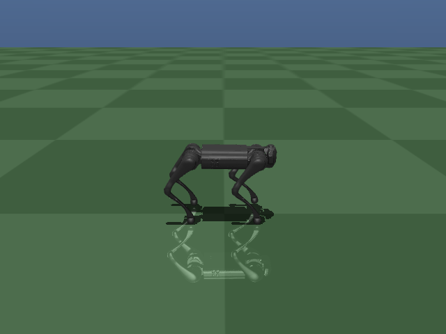
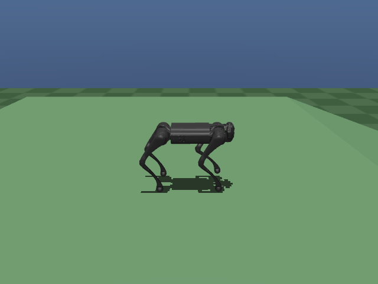
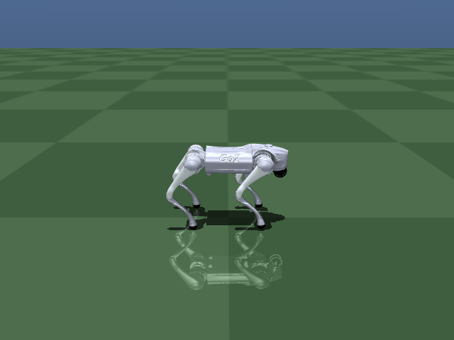

# Go1 Quadruped Locomotion

Trains a Unitree Go1 to walk with MuJoCo physics + PPO (Stable-Baselines3).
The pipeline has four stages, each building on the last:

0. **Scripted crawl** (no RL) — a hand-designed gait, to check the model and
   physics can walk at all before trusting RL to discover one.
1. **RL, flat terrain** — PPO learns to track a commanded forward speed from
   0.2–1.0 m/s with a clean, symmetric trot.
2. **RL, rough terrain** — fine-tuned on a random heightfield up to ±12 cm,
   plus friction/mass/push randomization.
3. **RL, slopes and stairs** — fine-tuned further on ramp slopes (±20°) and
   stairs (risers up to 12 cm), on top of everything from stages 1-2.
   Discrete obstacles (isolated bumps) turned out to need no dedicated
   training at all — the existing rough-terrain skill already generalizes.

All four are done (developed on the `stage3-terrain-envelope` branch, merged
to `main`). See [Stage 3: slopes, stairs, and discrete obstacles](#stage-3-slopes-stairs-and-discrete-obstacles)
for the full results and known limits. Current best overall checkpoint:
`runs/p_stairs` (handles everything from stages 1-2, plus slopes to ±20°,
stairs to 6 cm, and discrete obstacles cleanly; ascending stairs above
~8 cm is a known, documented limit).

A ready-to-run copy is committed at `pretrained/p_stairs/` so you can watch
it walk right after cloning, no training needed:
```bash
pip install -r requirements.txt
python play.py --run-dir pretrained/p_stairs --target-speed 0.5 --stair-height 0.06 --record out.gif
```
(`pretrained/o_slope_consolidate/` — slopes and terrain, no stairs yet —
`pretrained/k_hardmine/` — terrain only — and `pretrained/x_mesh_finetune/`
— the higher-fidelity mesh model, Stage 4 below — are also committed, in
case you want a different checkpoint specifically.)

Stage 6 below trains a *different robot* (Unitree Go2) through the
equivalent of stage 1 only — see
[Stage 6: a different robot — Unitree Go2](#stage-6-a-different-robot--unitree-go2).
`pretrained/go2_speed_curriculum/` is its own committed checkpoint.

For PPO background, why the reward function looks the way it does, the
full stage-by-stage story (including the failures that motivated each
reward term and each fix), and a demo, see
[PPO_AND_PROJECT_JOURNEY.md](PPO_AND_PROJECT_JOURNEY.md).

```
go1_rl_walk/
├── assets/go1.xml         # MJCF model (self-contained, capsule-based)
├── envs/go1_env.py        # Gymnasium env: obs, action, reward, termination, terrain
├── scripted_gait.py       # Hand-designed crawl gait (stage 0, no RL)
├── configs/flat_terrain.yaml  # settings behind runs/k_hardmine, by stage (read-only reference —
│                          #   train.py takes flags, not this file; see "How this was trained")
├── train.py               # PPO training entrypoint (--run-name writes to runs/<name>/)
├── eval_policy.py         # Randomized multi-episode eval: fall rate, speed, drift
├── gait_stats.py          # Per-foot diagnostics: step rate, duty, swing height
├── play.py                # Load a checkpoint (--run-dir) and watch it walk
├── smoke_test.py          # Sanity-check the model with no RL deps; also runs the crawl gait
├── runs/<name>/           # One dir per training run: checkpoints/, logs/, args.json, env_kwargs.json
│                          #   (gitignored — see pretrained/ for a committed checkpoint)
├── pretrained/             # Committed, ready-to-run checkpoints (same layout as a run dir, minus
│   ├── k_hardmine/         #   logs/) -- each is a valid --run-dir with no training required:
│   ├── o_slope_consolidate/ #  k_hardmine (stages 1-2), o_slope_consolidate (+slopes),
│   └── p_stairs/            #  p_stairs (+stairs -- current overall best)
├── requirements.txt
└── LICENSE                # MIT
```

## 1. Setup

```bash
python -m venv venv && source venv/bin/activate   # or conda
pip install -r requirements.txt
```

GPU is optional for MuJoCo (CPU physics is fine), but strongly speeds up
PPO's neural-net updates. This machine trains at ~800-2800 steps/s on CPU
alone (higher with more `--n-envs` and once resuming a converged policy,
since episodes run to their full 1000-step length instead of ending early).

## 2. Sanity check the model first

```bash
cd go1_rl_walk
python smoke_test.py --view
```

This loads `assets/go1.xml`, holds the standing pose with a simple PD
controller (no RL yet), and opens the MuJoCo viewer so you can confirm
the robot stands without exploding/clipping through the floor.

Then check it can actually walk, still with no RL, using the scripted crawl
gait in `scripted_gait.py` (one leg swings at a time, with a body-weight
shift onto the other three so the center of mass never leaves the support
triangle — the earlier scripted attempts skipped the weight shift and went
nowhere, or worse, toppled):

```bash
python smoke_test.py --walk --record walk_crawl.gif --seconds 30
```

Confirming this before spending compute on training separates "the model/
physics can't walk" from "RL hasn't learned to walk yet" — the two look
identical from a failed training run alone.

> **Viewer crashes with a GLFW/Wayland segfault?** This is a known
> GLFW-on-Wayland issue, not a project bug. Try forcing XWayland:
> ```bash
> WAYLAND_DISPLAY= python3 smoke_test.py --view
> ```
> If that doesn't work, skip the interactive viewer entirely and render
> offscreen to a GIF instead (no window/GLFW involved at all):
> ```bash
> python3 smoke_test.py --record stand.gif
> ```
> `play.py` supports the same `--record out.gif` flag for watching a
> trained policy without the interactive viewer.

> **Model note:** `assets/go1.xml` is built from published Go1 reference
> dimensions (trunk box, leg offsets, link lengths, joint ranges, motor
> torque limits — 23.7 N·m hip/thigh, 35.55 N·m knee) using primitive
> capsule/box geometry, so it's dynamically reasonable and needs no
> external mesh files. For visual fidelity or exact inertial tuning,
> swap in the official model from MuJoCo Menagerie once you have
> internet access:
> ```bash
> git clone https://github.com/google-deepmind/mujoco_menagerie
> ```
> then point `DEFAULT_XML` in `envs/go1_env.py` at
> `mujoco_menagerie/unitree_go1/go1.xml`. The env addresses joints,
> actuators, and sensors by name, so either file works unmodified.

## How this was trained

`train.py --help` lists every flag, grouped (run bookkeeping, PPO/exploration,
physics/control, command speed, gait clock, reward shaping, terrain, domain
randomization). Rather than guessing a combination from scratch, this is the
actual staged recipe that produced `runs/k_hardmine`, each stage `--resume`ing
the last. Exact flags for any past run are also always in that run's
`runs/<name>/args.json`.

**Stage 1a — flat, fixed 0.3 m/s, diagonal trot clock** (`runs/h_clock`, 6M
steps, ~15 min):
```bash
python train.py --run-name my_h_clock --timesteps 6000000 --n-envs 8 \
    --target-speed 0.3 --kp 80 --kd 2 --log-std-init -1.0 \
    --air-time-cap --air-time-weight 1.0 --foot-clearance-weight 0.3 \
    --phase-match-weight 0.5 --phase-match-warmup-steps 1000000 \
    --gait-period 0.7 --gait-style trot
```

**Stage 1b — speed curriculum, 0.2-1.0 m/s** (`runs/i_speed_curriculum`, +12M
steps, ~70 min):
```bash
python train.py --run-name my_speed --n-envs 16 --timesteps 12000000 \
    --resume runs/my_h_clock/checkpoints/go1_flat_final_*.zip \
    --resume-log-std -1.6 --learning-rate 2e-4 \
    --speed-range-min 0.2 --speed-range-max 1.0 \
    --speed-curriculum-start 0.3 --speed-curriculum-steps 8000000 \
    --gait-period 0.7 --gait-period-fast 0.45 --gait-style trot \
    --phase-match-weight 0.5 --phase-match-warmup-steps 1000000 \
    --lateral-tracking-weight 0.5 --body-frame-velocity \
    --kp 80 --kd 2 --air-time-cap --air-time-weight 1.0 --foot-clearance-weight 0.3
```

**Stage 2a — rough terrain, 0-12 cm heightfield** (`runs/j_terrain`, +14M
steps, ~1.6 h):
```bash
python train.py --run-name my_terrain --n-envs 16 --timesteps 14000000 \
    --resume runs/my_speed/checkpoints/go1_flat_final_*.zip \
    --resume-log-std -1.8 --learning-rate 2e-4 \
    --terrain-amp-max 0.12 --terrain-curriculum-start 0.04 --terrain-curriculum-steps 8000000 \
    --friction-range 0.5 1.25 --mass-scale-range 0.9 1.1 --push-velocity 0.3 \
    --speed-range-min 0.2 --speed-range-max 1.0 --speed-curriculum-start 1.0 --speed-curriculum-steps 1 \
    --gait-period 0.7 --gait-period-fast 0.45 --gait-style trot \
    --phase-match-weight 0.5 --phase-match-warmup-steps 1 \
    --lateral-tracking-weight 0.5 --body-frame-velocity \
    --kp 80 --kd 2 --air-time-cap --air-time-weight 1.0 --foot-clearance-weight 0.3
```

**Stage 2b — hard-mine the worst corner** (`runs/k_hardmine`, +8M steps, ~55
min): the curriculum above only ramps the terrain amplitude's *upper* bound,
so episodes keep sampling amplitude from `U(0, 12cm)` even late in training —
the truly hard combination (large bumps at high speed together) stays a thin
slice of what the policy ever sees. Fine-tune with the sampling biased
directly at the hard region instead of widening the curriculum further:
```bash
python train.py --run-name my_hardmine --n-envs 16 --timesteps 8000000 \
    --resume runs/my_terrain/checkpoints/go1_flat_final_*.zip \
    --resume-log-std -1.8 --learning-rate 1.5e-4 \
    --terrain-amp-min 0.06 --terrain-amp-max 0.12 --terrain-curriculum-start 0.12 --terrain-curriculum-steps 1 \
    --speed-range-min 0.5 --speed-range-max 1.0 --speed-curriculum-start 1.0 --speed-curriculum-steps 1 \
    --friction-range 0.5 1.25 --mass-scale-range 0.9 1.1 --push-velocity 0.3 \
    --gait-period 0.7 --gait-period-fast 0.45 --gait-style trot \
    --phase-match-weight 0.5 --phase-match-warmup-steps 1 \
    --lateral-tracking-weight 0.5 --body-frame-velocity \
    --kp 80 --kd 2 --air-time-cap --air-time-weight 1.0 --foot-clearance-weight 0.3
```

**Stage 3a — slopes.** The actual result (`runs/o_slope_consolidate`) took
4 chained fine-tunes from `k_hardmine`, not one step — `l_slopes` (14M
steps, introduced the slope curriculum, but regressed flat-ground drift and
gait symmetry once it reached its hardest angle) → `m_slope_hardmine` (+8M,
hard-mined the hard region, fixed the drift but only partly fixed the
symmetry) → `n_slope_steep_hardmine` (+10M, narrowed further, fixed some
angles and broke others — 3rd occurrence of narrow hard-mining trading one
corner's quality for another's) → `o_slope_consolidate` (+12M, a single
broad pass: full ranges, no narrowing, less reopened exploration noise —
this is what finally gave a clean win on every metric at once). See
[Stage 3: slopes and stairs](#stage-3-slopes-and-stairs) for the full story.
**Untested shortcut:** if starting fresh, the broad-pass command below run
directly from `k_hardmine` for more steps (order 40M+, matching the total
above) would be worth trying before repeating the narrow intermediate
steps — but this hasn't actually been verified as a substitute for the real
chain, so don't assume it reproduces the same result:
```bash
python train.py --run-name my_slopes --n-envs 16 --timesteps 12000000 \
    --resume pretrained/k_hardmine/checkpoints/go1_flat_final.zip \
    --resume-log-std -2.0 --learning-rate 1.2e-4 \
    --speed-range-min 0.2 --speed-range-max 1.0 --speed-curriculum-start 1.0 --speed-curriculum-steps 1 \
    --terrain-amp-min 0.0 --terrain-amp-max 0.12 --terrain-curriculum-start 0.12 --terrain-curriculum-steps 1 \
    --slope-min-deg 0 --slope-max-deg 20 --slope-curriculum-start 20 --slope-curriculum-steps 1 --ramp-length 8.0 \
    --friction-range 0.5 1.25 --mass-scale-range 0.9 1.1 --push-velocity 0.3 \
    --gait-period 0.7 --gait-period-fast 0.45 --gait-style trot \
    --phase-match-weight 0.5 --phase-match-warmup-steps 1 \
    --lateral-tracking-weight 0.7 --body-frame-velocity \
    --kp 80 --kd 2 --air-time-cap --air-time-weight 1.0 --foot-clearance-weight 0.3
```

**Stage 3b — stairs** (`runs/p_stairs`, resumed from `o_slope_consolidate`,
14M steps): every axis kept at its full existing range from the start —
narrowing while introducing a new axis reliably eroded other capabilities in
stage 3a, so this stage deliberately didn't repeat that mistake:
```bash
python train.py --run-name my_stairs --n-envs 16 --timesteps 14000000 \
    --resume pretrained/o_slope_consolidate/checkpoints/go1_flat_final.zip \
    --resume-log-std -1.8 --learning-rate 2e-4 \
    --speed-range-min 0.2 --speed-range-max 1.0 --speed-curriculum-start 1.0 --speed-curriculum-steps 1 \
    --terrain-amp-min 0.0 --terrain-amp-max 0.12 --terrain-curriculum-start 0.12 --terrain-curriculum-steps 1 \
    --slope-min-deg 0 --slope-max-deg 20 --slope-curriculum-start 20 --slope-curriculum-steps 1 --ramp-length 8.0 \
    --stair-height-min 0.0 --stair-height-max 0.12 --stair-curriculum-start 0.0 --stair-curriculum-steps 8000000 \
    --stair-depth 0.25 --num-stairs 8 \
    --friction-range 0.5 1.25 --mass-scale-range 0.9 1.1 --push-velocity 0.3 \
    --gait-period 0.7 --gait-period-fast 0.45 --gait-style trot \
    --phase-match-weight 0.5 --phase-match-warmup-steps 1 \
    --lateral-tracking-weight 0.7 --body-frame-velocity \
    --kp 80 --kd 2 --air-time-cap --air-time-weight 1.0 --foot-clearance-weight 0.3
```

Monitor any of these with `tensorboard --logdir runs` (`rollout/ep_len_mean`
climbing to 1000 = full-length episodes; `reward_components/*` breaks the
total down by term; `curriculum/*` shows the speed/terrain ramps).

## 3. Evaluate and watch a trained policy

```bash
python eval_policy.py --run-dir runs/k_hardmine --episodes 16 --seconds 20
```
Runs many randomized episodes (reset jitter, friction, and — for terrain runs
— mass/terrain/pushes) in parallel and reports fall rate, speed tracking, and
drift, sweeping the trained command/terrain range automatically. **Judge any
change this way, not from a single episode** — single scripted-gait runs
early in this project swung between "walks 0.5 m" and "falls over" for
neighboring parameters, purely from randomness.

```bash
python gait_stats.py --run-dir runs/k_hardmine --target-speed 0.8 --terrain-amplitude 0.12
```
Per-foot step rate, duty cycle, and swing height/timing — catches a lopsided
gait (e.g. front legs stepping twice as often as rear) that fall rate and
speed alone hide.

```bash
python play.py --run-dir runs/k_hardmine --target-speed 0.8 --terrain-amplitude 0.12 --record out.gif
```
Watch it (or record a GIF, avoiding the GLFW viewer entirely). `--run-dir`
rebuilds the exact env the checkpoint was trained with (kp/kd, reward
weights) from that run's saved `env_kwargs.json`.

## How the task is set up

- **Action space**: 12 target joint-position offsets (one per hip/thigh/
  calf joint), PD-tracked to torque at 250 Hz internally.
- **Observation** (51-dim): gravity vector in body frame, base angular
  velocity, base orientation quaternion, 12 joint positions (relative to
  a neutral standing pose), 12 joint velocities, the previous action, a
  3-dim velocity command (`[target_speed, 0, 0]`, sampled per episode when
  training with a speed range), and a 2-dim sin/cos gait-phase clock.
  The policy is **blind** — no terrain information (heightmap, ray casts) —
  it only feels the ground through joint torques and the trunk IMU.
- **Reward**: forward-velocity tracking (body-frame, if `--body-frame-
  velocity`) + zero-sideways-velocity tracking + upright orientation +
  heading/lateral-position drift penalties + torque/energy cost +
  action-rate smoothness + a diagonal-trot timing bonus against a
  speed-scaled clock (`--phase-match-weight`) + a capped foot air-time
  bonus + a foot-clearance bonus (its target scales up per-episode to
  clear the current stair height, `max(target_clearance, stair_h+0.03)`)
  + survival bonus. Optional but currently
  unused (0 weight) in the working recipe: trot-symmetry bonus and
  per-foot duty-cycle penalties — see `train.py --help` for why. Weights
  are in `Go1FlatEnv._compute_reward`.
- **Termination**: trunk tips past ~60° from vertical, or trunk height
  (relative to the local terrain) leaves the `[0.15, 0.6]` m band.
- **Foot contact**: real MuJoCo contact force (summed over all of a foot's
  contact points, >1 N), not a height threshold — a height threshold is
  wrong the moment the ground isn't flat, and was actually wrong on flat
  ground too in an earlier version (the foot site sits at the sphere's
  center, above its resting height, so a standing robot was seen as having
  zero feet down).
- **Domain randomization**: joint/height/yaw jitter and floor+foot friction
  on every run; trunk mass scale and random horizontal pushes on terrain
  runs (`--mass-scale-range`, `--push-velocity`).
- **Rough terrain, slopes, stairs** (`--terrain-amp-max`/`--slope-max-deg`/
  `--stair-height-max`): all three share one MuJoCo heightfield, regenerated
  every episode and additive (any combination can be nonzero at once — a
  sloped, bumpy staircase). Bumps are interpolated random noise (feature
  size 15 cm-1 m); a slope is a flat pad, then a constant grade over
  `--ramp-length`, then a flat plateau; stairs are the same shape with a
  step function instead. Direction (uphill/downhill, ascending/descending)
  is represented by which end of the pad is elevated, not a negative
  height — a heightfield can't go below its own z=0 plane. A stair riser
  is a steep ramp within one 5 cm grid cell, not a true vertical face.
  The terrain-generating code is only built into the model when at least
  one of these is enabled — the flat env is bit-identical to before any
  terrain support existed.
- **Gait clock timing** (`--gait-period-fast`/`--gait-period-stair-stretch`):
  the trot clock's period shortens for higher commanded speed and
  lengthens for a taller current-episode stair, giving a big lift more
  real time to complete instead of being rushed by a fixed rhythm.

## Current status

16-64 randomized 20 s episodes per cell, deterministic policy, `runs/k_hardmine`:

| Terrain amplitude | Falls @ 0.3 m/s | Falls @ 0.8 m/s | Falls @ 1.0 m/s |
|---|---|---|---|
| flat (0 cm) | 0% | 0% | — |
| 4 cm | 0% | 0% | — |
| 8 cm | 0% | 0% | — |
| 12 cm | 0% | 0% | 0% |

Speed tracking holds within ~5-10% of every commanded speed at every
amplitude; the trot stays symmetric (all four feet at the same step rate and
duty cycle) throughout, with swing height rising automatically on rougher
terrain (6-10 cm on flat ground vs. 14-22 cm on 12 cm terrain at 0.8 m/s).

Getting here took several false starts worth knowing about if you're
extending this:
- **gSDE exploration nearly killed RL entirely.** Its effective noise
  (`std × 128-dim latent features`) toppled an untrained policy in ~0.7 s,
  so the first PPO runs only ever learned to lunge and fall. `train.py`
  now defaults to plain Gaussian noise, off by default (`--no-use-sde`).
- **A fixed gait-timing clock at full strength from step 0 makes things
  worse, not better** — it demands precisely-timed lifts before the policy
  can balance at all. Ramp it in instead (`--phase-match-warmup-steps`).
- **An uncapped air-time reward let one leg hover for 457 ms** and out-earn
  several correct steps elsewhere, causing a lopsided gait where front legs
  stepped twice as often as rear. Fixed by `--air-time-cap`.
- **Reward-shaping weights can be gamed.** A heavier trot-symmetry weight,
  tried alongside other shaping changes, converged to a hobble on a single
  diagonal pair (one pair almost always down, the other almost always up) —
  it satisfied the letter of "diagonal pairs alternate" without producing a
  real trot.
- **A terrain curriculum that only ramps the amplitude's upper bound
  under-trains the hardest corner** even after the ramp finishes, since
  sampling is still uniform from 0. Fixed with a `--terrain-amp-min`
  hard-mining fine-tune once the full curriculum has already run.

## Stage 3: slopes, stairs, and discrete obstacles

Both reuse the rough-terrain heightfield end to end (same spawn-safety lift,
terrain-relative height/contact/termination) — see `Go1FlatEnv._generate_terrain`.
A slope is a flat pad, then a constant grade over a configurable run, then a
flat plateau (`--slope-min-deg`/`--slope-max-deg`/`--ramp-length`). Stairs are
the same shape with a step function instead of a ramp (`--stair-height-min`/
`--stair-height-max`/`--stair-depth`/`--num-stairs`); both directions
("uphill"/"downhill", "ascending"/"descending") are represented by which end
of the pad is elevated, since a MuJoCo heightfield can't go below its own
z=0 plane. **Known approximation:** a heightfield can only change height
within one 5 cm grid cell, so a stair riser is a steep ramp (~63° for a
12 cm step), not a true vertical face.

**Results, `runs/p_stairs`** (resumed from `runs/o_slope_consolidate`, full
0.2-1.0 m/s / 0-12 cm terrain / 0-20° slope / 0-12 cm stairs ranges, all kept
at their full extent rather than narrowed — see the whack-a-mole note below):

| | Falls |
|---|---|
| Slopes alone, ±20°, flat ground | 0% |
| Slopes + 12 cm rough terrain, ±20° | 0-6% |
| Stairs alone, ≤6 cm, either direction | 0% |
| Stairs alone, 12 cm ascending | 6% falls, but see the limitation below |
| Stairs alone, 12 cm descending | 31% |
| Descending 12 cm stairs + any steep downhill slope | ~100% (an extreme, rarely-occurring compound corner) |

**Known limitation, accepted after four different fixes all failed the same
way: ascending stairs above ~8 cm.** Fall rate alone is misleading here — the
robot mostly doesn't fall, it gets physically *stuck*, planting itself at the
first or second step and making no further forward progress regardless of
which fix was tried (confirmed by a user manually testing 12 cm ascending
stairs, then traced numerically: trunk x-position plateaus at ~1.8-1.9 m and
oscillates there for the rest of the episode; visually confirmed in a GIF).
Four structurally different fixes were tried, in this order, each building on
the last (`runs/p_stairs` -> `t_heightmap` -> `u_stair_static`):

1. **Missing incentive**: the foot-clearance reward capped its benefit at a
   fixed 4 cm lift regardless of the actual obstacle (median swing height was
   only 6.6 cm on a 12 cm riser). Fixed with a per-episode adaptive target
   (`_episode_target_clearance = max(target_clearance, stair_h + 0.03)`) —
   confirmed correctly active. No change to the stuck behavior.
2. **Missing time**: the trot clock enforces a fixed ~0.3 s swing regardless
   of what's underfoot. Added `--gait-period-stair-stretch` to slow the clock
   on tall steps (mirrors how `--gait-period-fast` already speeds it up for
   higher commanded speed) — confirmed correctly stretching the period. No
   change; speed also measurably degraded starting around 8 cm even before
   either fix (0.35 m/s at 8 cm vs. a 0.5 m/s command) — a pre-existing
   pattern, not something either fix introduced.
3. **Missing information**: the policy is blind (no exteroception), so it
   can't anticipate a tall step before touching it, unlike a slope (whose
   grade gives an advance tilt cue through gravity sensing). Added
   `--use-terrain-heightmap` (see below) and fine-tuned from a warm-started
   checkpoint. Result was genuine but double-edged: speed at moderate
   heights improved measurably (6 cm 0.448→0.512 m/s, 8 cm 0.352→0.454,
   10 cm 0.146→0.204), but at 12 cm specifically the fall rate got *worse*
   (≈5%→46% — it tries harder and fails outright more often instead of
   safely stalling), and the core stuck-at-the-same-position behavior was
   unchanged.
4. **Rigid gait pattern**: the trot's always-≥2-feet-down diagonal pattern
   might not allow the active weight-shifting a very long single-leg swing
   needs (the same lesson as the stage-0 scripted crawl gait's
   center-of-mass shift). Added `--phase-match-stair-relax` (removes the
   trot's pull as stair height grows) and `--static-stability-weight` (a
   direct reward for >2 feet down, scaled by stair height) — both verified
   correctly implemented and produced a small, real, correctly-directed
   effect (mean feet-down during the stall rose 1.64→1.79; moments with 0
   feet down dropped 11%→4%), but the stall position was *identical* to
   before — more cautious, not more successful.

A quick kinematic check (`scripted_gait.leg_ik`) rules out the simplest
explanation: the joint angles needed for a 12 cm (even 18 cm) lift are
comfortably within the leg's joint-range limits, so this isn't a hard
kinematic wall. **The real signal is that four unrelated intervention types
(incentive, timing, information, gait structure) all converged to the
identical failure** — stronger evidence than any single failure that
incremental fine-tuning from an already-converged, trot-locked policy keeps
landing back in the same local optimum, rather than any one specific
ingredient being missing. Breaking out of it would likely need a
qualitatively different approach (training a stairs-focused curriculum from
scratch, or well before the trot fully converges, rather than another reward
tweak on the current lineage) — a materially bigger undertaking than any of
the four attempts above, not attempted here. `pretrained/p_stairs` remains
the accepted checkpoint; all four fixes are kept in the codebase (all
default off/unchanged) as reasonable, generically useful, well-verified
levers, even though none solved this specific case.

**Terrain-aware observation** (`--use-terrain-heightmap`, attempt #3 above):
adds a 3×3 grid (9 dims, observation 51→60) of terrain height ahead of the
trunk (forward 0.15/0.35/0.55 m × lateral -0.15/0/0.15 m, in the trunk's own
frame so it's always "ahead of me" regardless of heading), relative to the
height directly under the trunk — a minimal stand-in for real exteroception.
All zero on flat ground; verified to match theory exactly on a slope
(`tan(angle) × distance`) and to correctly read "+10 cm one step ahead, +20 cm
two steps ahead" near a stair riser. Since growing the observation breaks
`--resume` for every existing (blind) checkpoint, `expand_obs_checkpoint.py`
warm-starts a larger-observation policy from an existing one instead of
retraining the whole staged stack from scratch: it copies every weight except
the first Linear layer of the policy/value MLPs, zero-initializing the new
input columns, so the expanded model is mathematically **identical** to the
original at t=0 regardless of what the new channels contain — verified two
ways (the script's own check, and cross-checked with `eval_policy.py`: the
warm-started copy and the original gave numbers matching to the printed
decimal on flat ground) before trusting it enough to fine-tune.

**The "broad consolidation" lesson from slopes did not transfer to stairs.**
For slopes, narrow hard-mining passes reliably traded one corner's quality
for another's (fixing one angle's gait symmetry regressed another's, or fixed
falls at the cost of flat-ground drift) across three successive attempts,
until a single broad pass (full range, longer duration, less reopened
exploration noise) finally gave a clean win on every metric at once
(`runs/o_slope_consolidate`). Applying that exact same "broad, full-range,
lower-noise" strategy to stairs (`runs/q_stairs_consolidate`) did **not**
repeat that success — it improved some fall-rate corners but made gait
symmetry and flat-ground drift *worse* than the run before it, without fixing
the underlying stall. **Don't assume a fix that worked for one terrain type
generalizes to another — re-verify every time**, and don't assume "more
training, less narrowing" is a universal fix just because it worked once.

**Two other things worth knowing if you extend this:**
- Fall-rate metrics alone miss "stuck without falling." `eval_policy.py`'s
  fall rate only counts termination events; a policy that stalls without
  tipping over reports a *low* (reassuring) fall rate while completely
  failing the task. Always sanity-check a policy visually (`play.py
  --record`) or by tracing trunk position over time, not just by pass/fail
  statistics — this is exactly how the stairs stall was found (by a human
  watching it, not by the automated eval).
- Signed height/angle CLI flags (`--stair-height`, `--slope-deg`) are in
  metres/degrees, not centimetres. Passing `-6` instead of `-0.06` silently
  creates absurd multi-metre terrain that clips against the heightfield's
  elevation cap — the tell is identical-looking stats across different
  inputs, since both get clamped to the same degenerate geometry.

**Discrete obstacles: already solved, no dedicated training needed.**
Unlike a slope or staircase, which spans the whole course width and can't be
avoided, an isolated bump (`--obstacle-height-max`, scattered
`--num-obstacles` per episode within `--obstacle-lane-half-width` of the
centerline) can simply be walked around. `pretrained/p_stairs`, with no
obstacle-specific training at all, handles them cleanly even at absurd
heights: 0% falls up to 14 cm, 0-6% even at 18-22 cm (taller than the
robot's own thigh segment) — the same reactive rough-terrain skill it
already has generalizes fine to sparse bumps. Confirmed visually
(`play.py --seed 20 --obstacle-height 0.15`, both `--camera track` and
`--camera topdown`): stable throughout, whether stepping over a small
bump or drifting around a tall one.

One real bug surfaced while checking this, worth knowing if you extend the
placement logic: obstacles were originally scattered across the full ±3 m
course width, but the robot only ever wanders ±0.4-0.5 m off-centerline —
so almost every obstacle landed completely outside its actual path,
making the first "0% falls" result trivial rather than a real finding
(confirmed: an episode's terrain had a 15 cm obstacle, but the terrain
height was exactly 0 everywhere along the robot's entire walked path).
Fixed by constraining placement to `--obstacle-lane-half-width` (default
0.4 m) around the centerline instead. **A "no falls" result is only
meaningful once you've confirmed the hard part of the terrain was actually
in the robot's path** — the same lesson as the fall-rate-vs-stuck issue
above, generalized: an evaluation can look clean for the wrong reason.

If you want obstacles to actually force something new (matching the
original "deliberate foot placement" idea), they'd need to be genuinely
unavoidable — spanning the full lane width so stepping over/between them
is the only option, or narrow gaps that must be jumped rather than bumps
that can be dodged. Not attempted here since the current (dodgeable)
design already turned out to need no further work.

## Sim-to-real robustness randomization

`pretrained/p_stairs` has never seen anything but a perfect, instantaneous,
noise-free simulation: exact torques from fixed PD gains, an action applied
the instant it's computed, an observation that exactly reflects the current
instant. A real robot has none of that -- motor-to-motor variance, a delay
between commanding an actuator and it responding, sensor noise, and a delay
before a reading reaches the controller. `envs/go1_env.py` adds four
opt-in, additive mechanisms for this (all default off, verified
bit-identical when unused):

- `--kp-range`/`--kd-range`/`--torque-scale-range`: PD gains and a separate
  multiplicative torque-strength factor, sampled once per episode.
- `--action-latency-range`/`--observation-latency-range`: a small FIFO
  buffer delays the effective action used for torque, and separately delays
  what the observation reflects, by a randomly-sampled number of control
  steps per episode. The policy's own `prev_action` observation and
  action-rate reward still see the *raw* commanded action -- only the
  physical effect and the sensed observation are delayed.
- `--observation-noise-scale`: per-channel Gaussian noise on the physically
  sensed quantities (gravity, gyro, orientation, joint pos/vel, heightmap).
  Command, previous action, and the phase clock are never noised, since
  they aren't physically sensed signals.

**Zero-shot baseline** (`p_stairs`, never trained with any of this,
evaluated *with* it at 0.8 m/s flat, 16 episodes): already robust to
torque/PD variance (0% falls, vs. 6.25% with no randomization at all) and
observation noise (6.25%, unaffected) -- but **latency is a real
vulnerability** (37.5% falls with a 0-4 control-step / 0-80 ms delay).

**Two fine-tuning attempts, both from `p_stairs`, neither adopted:**

1. `runs/v_sim2real`: all four mechanisms at full configured strength from
   step 0 -- unlike every other axis in this project (terrain, slope,
   stairs, obstacles), which all ramped in gradually on first introduction.
   Result: broadly regressed. Even basic flat-ground speed tracking broke
   (0.8 m/s command only reached 0.544 m/s, vs. `p_stairs`'s own 0.780), and
   robustness got *worse* on every axis, including zero change on the one
   target metric (latency, still 37.5%).
2. `runs/w_sim2real_curr`: fixed the obvious problem -- added
   `sim2real_scale_current`, a shared curriculum multiplier ramping every
   axis's deviation from nominal from 0 to full strength over the first 8M
   of 14M steps, mirroring the `RampCallback` pattern already used
   everywhere else (verified: scale=0 gives exactly nominal values
   regardless of the configured range, scale=1 exactly reproduces the
   original full-strength values). Result: still broadly regressed, nearly
   identically to attempt 1 (0.8 m/s command still only reached 0.566 m/s),
   and **latency's fall rate was exactly 37.5% again, unchanged by the
   fix**.

The fact that latency didn't move at all between two structurally different
training setups is the real finding: the policy has no observation channel
for *how much* delay the current episode has, so it can't specialize a
strategy per episode -- it can only find one compromise averaged across the
whole 0-4 step range, which ends up worse everywhere (including the
zero-latency case, where an undedicated policy like `p_stairs` already
tracks speed almost exactly) without being distinctly better at the high-
latency end either. The standard real-world fix for this -- a "teacher"
policy trained with privileged knowledge of the true per-episode latency,
then distilled into a realistic "student" policy that doesn't have it -- is
a substantially bigger technique than a reward/curriculum tweak, not
attempted here. Torque/PD randomization and observation noise showed real,
if partial, improvement from the curriculum fix (unlike latency), so they
may be more tractable in isolation if revisited.

**Decision: stop here, `pretrained/p_stairs` remains the accepted
checkpoint.** Treated the same way as the ascending-stairs limit -- a
documented, accepted boundary rather than an open problem to keep chasing.
The four mechanisms stay in the codebase (all default off) as reasonable,
generically useful, well-verified infrastructure.

## Stage 4: higher-fidelity mesh model

<p float="left">
  
  
</p>

*Left: flat ground, 0.5 m/s. Right: descending a 20° slope at 0.3 m/s — the
drift on this exact scenario is what the fine-tune fixed (see the table
below). Both are `pretrained/x_mesh_finetune` on `assets/go1_mesh.xml`.*

To regenerate these (or record any other checkpoint/scenario — swap
`--run-dir`, `--target-speed`, `--slope-deg`/`--stair-height`/
`--terrain-amplitude`, `--seed`, `--camera` as needed):
```bash
python play.py --run-dir pretrained/x_mesh_finetune --episodes 1 --seed 5 \
    --target-speed 0.5 --frame-stride 4 --record media/mesh_model_flat.gif --camera track

python play.py --run-dir pretrained/x_mesh_finetune --episodes 1 --seed 3 \
    --target-speed 0.3 --slope-deg -20 --frame-stride 4 \
    --record media/mesh_model_slope_descent.gif --camera track
```
`--frame-stride 4` (vs. the default 2) roughly halves the GIF's file size
by keeping every 4th rendered frame instead of every 2nd — the default is
fine for closer visual inspection, but a courser stride keeps demo GIFs
meant for the README/GitHub small. `--camera chase_rear` (follows from
behind) is usually more informative than `track` (side-on) for spotting
left/right leg asymmetry or watching a stair approach head-on; `topdown`
is best for footfall/stride-pattern timing.

`assets/go1_mesh.xml` swaps in the official MuJoCo Menagerie Unitree Go1
model (meshes, per-link inertial tensors, per-link collision primitives,
real joint ranges from the spec; BSD-3-Clause, `assets/meshes/LICENSE`),
merged with this project's own control/sensor/terrain scheme so it's a
drop-in replacement for `assets/go1.xml` — every existing checkpoint,
`envs/go1_env.py`'s name-based lookups, and the terrain-injection code all
work against it unmodified (see the file's own header for exactly what
changed vs. what was deliberately kept the same, isolating the geometry/
inertia/joint-range upgrade as one variable, not bundled with e.g. also
adopting Menagerie's own solver settings).

Leg segment lengths are identical between the two files, so the existing
"stand" keyframe needed no changes — verified: FK gives the same standing
foot height on both, and PD-holding the stand pose is stable for 10s of
sim time.

**Zero-shot check** (`pretrained/p_stairs`, no fine-tuning) across the
whole previously-tested grid found no new capability regression anywhere
(0% falls on flat/rough terrain 0-12cm x 0.3/0.8 m/s, slopes 0/±10/±20°,
stairs 0/±6cm; the known ascending-12cm-stairs stall reproduced almost
exactly — 0.084 vs 0.091 m/s — a useful cross-check that it's a genuine
gait-strategy limit, not an artifact of the old primitive geometry).
It did, however, show a consistent ~15-30% speed-tracking overshoot at
every setting (the corrected mass distribution/inertia changes how the
same PD torques convert to velocity) and larger lateral drift specifically
on downhill slopes.

**Fine-tuned**: `runs/x_mesh_finetune` (8M steps, resumed from `p_stairs`
on the mesh model, `--resume-log-std -1.8`, every terrain/slope/stair/speed
axis kept at its full existing range from the start — no curriculum
re-ramp needed since the zero-shot check already showed the whole grid
transfers). Committed at `pretrained/x_mesh_finetune/`.

| setting | original | mesh zero-shot | mesh fine-tuned |
|---|---|---|---|
| flat 0.3 m/s | 0% falls, 0.316 m/s | 0%, 0.419 | 0%, 0.293 |
| flat 0.8 m/s | 0%, 0.784 | 0%, 0.859 | 0%, 0.759 |
| terrain 12cm, 0.8 m/s | 0%, 0.756 | 0%, 0.834 | 0%, 0.746 |
| slope -10° | 0%, 0.304, drift 0.48m | 0%, 0.420, drift 1.00m | 0%, 0.284, drift 0.13m |
| slope -20° | 0%, 0.324, drift 0.78m | 0%, 0.485, drift 1.45m | 0%, 0.284, drift 0.53m |
| stairs +12cm (known stall) | 0%, 0.091 | 0%, 0.084 | 0%, 0.092 |
| stairs -12cm (24 episodes) | 4% falls | 8% falls | 12% falls |

The speed-tracking overshoot and slope drift are both fixed by the
fine-tune — downhill drift at -10°/-20° ends up *better* than the original
model's own numbers. The one soft spot: descending-12cm-stairs (already
the single hardest corner in the whole project) drifted from 4% falls
(original) to 8% (mesh zero-shot) to 12% (mesh fine-tuned) — a small,
noise-adjacent trend (confirmed with 24-episode samples, not the noisier
8-episode default) rather than a sharp regression, and the known ascending-
stairs stall is untouched either way, exactly as expected since this
fine-tune targeted broad recalibration, not that specific limit.

**Decision: adopt `pretrained/x_mesh_finetune`** as the mesh-model
checkpoint on this branch (`stage4-mesh-model`) — the fidelity upgrade
transfers cleanly and the fine-tune corrects its only real zero-shot
weaknesses, at the cost of a small, tracked dip on the already-hardest
existing corner. `pretrained/p_stairs` (the primitive-geometry model) is
untouched and remains `main`'s own checkpoint; this branch is a separate,
parallel track, not a replacement, pending a decision on merging it in.

```bash
# Watch it walk / evaluate it, exactly like any other pretrained checkpoint --
# env_kwargs.json already points at assets/go1_mesh.xml, no extra flag needed:
python play.py --run-dir pretrained/x_mesh_finetune --target-speed 0.5 --stair-height 0.06 --record out.gif
python eval_policy.py --run-dir pretrained/x_mesh_finetune --episodes 16

# To sim-to-sim test any OTHER existing checkpoint against the mesh model without
# retraining (what the zero-shot numbers above came from):
python eval_policy.py --run-dir pretrained/p_stairs --robot-xml assets/go1_mesh.xml --episodes 16
```

Not attempted: Menagerie's own solver settings (elliptic friction cone,
`impratio=100`, softer foot contact) — a separate follow-up variable,
deliberately not bundled with this change.

## Stage 5: higher top speed / flight-phase gait (known limitation)

The trot/bound gait clock always keeps ≥2 feet down (a strict phase<0.5
pair split, no gap) — a real ceiling on achievable speed, since a genuine
gallop/flying-trot needs a suspension phase (all 4 feet briefly airborne)
to extend stride length beyond what an always-supported gait allows.

Generalized the existing per-leg phase-offset machinery with a `gait_duty`
parameter (each leg is in prescribed stance when its own phase < duty,
instead of a hardcoded 0.5 split): `gait_duty=0.5` (default) reproduces
the original always-supported pattern exactly — verified via 40,000
randomized trials against the old hardcoded logic, zero mismatches.
`gait_duty < 0.5` opens a genuine flight window for a `(1 - 2*duty)`
fraction of the cycle, and `r_gait` is phase-aware (0 contacts scores the
flight-window bonus instead of the old unconditional penalty).

**First attempt** (`runs/y_flight_phase`, 14M steps, duty ramped 0.5→0.4
over *training time*): the core numeric goal worked — 0% falls across the
whole extended range up to 1.4 m/s. But `gait_stats.py` showed only 2% of
steps actually had 0 feet down (vs. the ~20% prescribed) — the policy
mostly gamed a faster, *asymmetric* trot instead of committing to real
flight (one leg at 3.84 steps/s vs. ~2.5 for the other three), producing a
drift/yaw regression that wasn't even confined to the new speed range —
the unchanged 0.3 m/s case also got worse. Root cause: `gait_duty` ramped
over training time with no notion of the episode's own commanded speed, so
every episode — even slow, already-solid ones — got the same narrowed
duty by the end of the ramp.

**Fix attempted**: `gait_duty_fast` makes duty interpolate per-episode by
*commanded speed* (mirroring `gait_period_fast`'s own interpolation) —
`runs/z_flight_duty_fixed`, resumed fresh from `x_mesh_finetune`. Result:
gait symmetry at high speed genuinely improved (step-rate spread 1.57→1.16
at 1.2 m/s) — that part of the diagnosis was correct. But overall drift/
yaw stayed elevated across the board, *including at 0.3 m/s where duty is
now provably locked at exactly 0.5* — `gait_stats.py` revealed a *new*
asymmetry there instead (one leg at 2.84 steps/s vs. ~1.45–1.50 for the
rest). Real flight-phase time barely moved either (still ~1% at 1.2 m/s).
No capability regression either time (0% falls maintained everywhere).

**Corrected understanding**: the low-speed degradation wasn't the
training-time-duty bug after all (now proven absent) — it's a broader
fine-tuning interference effect: extending the network's required
behavioral range perturbs the already-good low-speed policy through
shared weights, despite `target_speed` being in the observation. Same
shape as the ascending-stairs stall's "deep local optimum from fine-tuning
an already-converged, trot-locked policy" — a structurally different
demand placed on an existing policy via incremental fine-tuning, not
cleanly explained by any single bug.

**Decision: stop here, accept the limit.** Same treatment as the
ascending-stairs and sim-to-real-latency limits. `pretrained/x_mesh_finetune`
remains the accepted checkpoint; neither flight-phase attempt was promoted
to `pretrained/` (both stay as `runs/` experiments only). The `gait_duty`/
`gait_duty_fast`/`gait_period_fast_speed` mechanisms stay in the codebase
(all default off/unchanged) as reasonable, well-verified infrastructure.
Untried follow-ups if revisited: a *broad* consolidation pass (mirroring
what fixed the slopes stage) instead of incremental fine-tuning, or
strengthening the flight-phase reward incentive (the flight bonus and
normal-stance bonus are currently numerically equal, +0.08 each, giving no
extra pull to actually commit to synchronized flight over gaming cadence).

## Stage 6: a different robot — Unitree Go2

<p float="left">
  
  
</p>

*Left: `go2_h_clock`, 0.3 m/s. Right: `go2_speed_curriculum`, 0.8 m/s.*

Everything so far has been the Go1. `assets/go2_mesh.xml` adds the official
MuJoCo Menagerie Unitree Go2 — a genuinely different robot (not just
better geometry of the same one, unlike Stage 4's mesh swap), merged with
this project's own control/sensor/terrain scheme the same way. Real
differences from Go1, taken from Go2's own spec: heavier trunk (6.921 kg
vs. 5.204 kg), wider hip abduction range, a stronger knee motor (±45.43
vs. ±35.55 N·m), and — the one genuinely new modeling wrinkle — **asymmetric
front/back thigh joint ranges** (front −1.5708..3.4907, back
−0.5236..4.5379; Go1 uses the same range for all four legs), handled with
two thigh classes instead of Go1's one. Thigh/calf link lengths are
identical to Go1 (0.213 m each), so the existing standing keyframe carried
over unmodified — verified via FK and a PD-hold stability test (Go1's own
kp=80/kd=2 gains hold a stable stand on the heavier Go2 with no retuning).

A quick zero-shot check (a Go1-trained policy, `pretrained/x_mesh_finetune`,
no retraining) on the new model managed 0% falls at 0.3 m/s — mostly a
sign the two robots' proportions are close enough for the env plumbing to
produce sane physics, not a substitute for real training.

**Real Go2-specific training**, mirroring the exact two-step recipe that
started the original Go1 pipeline (Stage 1a/1b), trained from scratch (no
warm-start from a Go1 checkpoint — different enough robot that it would be
a confound, not a head start):

1. `runs/go2_h_clock` (6M steps, fixed 0.3 m/s, phase-match trot clock —
   the original `h_clock` recipe verbatim): 0% falls, speed exactly on
   target (0.300 m/s), and a cleaner initial gait than Go1's own first
   attempt needed — step-rate spread 1.04 (1.39–1.45 steps/s across all
   four legs) straight out of the first training pass.
2. `runs/go2_speed_curriculum` (12M steps, resumed from `go2_h_clock`,
   speed range ramped to 0.2–1.0 m/s — the original `i_speed_curriculum`
   recipe verbatim): **0% falls at every commanded speed** 0.3/0.5/0.8/1.0
   m/s, tracking 0.299/0.487/0.747/0.917 respectively (8% short at the
   top, comparable to Go1's own 10%-short pattern), with *perfect* gait
   symmetry at top speed — step-rate spread exactly 1.00 (all four legs at
   2.56 steps/s).

**Result: the whole recipe — reward shaping, PPO setup, curriculum
methodology — transferred to a different quadruped with no code changes
and no reward/PD retuning needed**, only swapping the model file and
training from scratch. Committed at `pretrained/go2_speed_curriculum/`.

```bash
python play.py --run-dir pretrained/go2_speed_curriculum --target-speed 0.8 --record out.gif
python eval_policy.py --run-dir pretrained/go2_speed_curriculum --episodes 16
```

Not yet attempted for Go2: rough terrain, slopes, stairs, or any of the
later Go1 stages — this is Go2's equivalent of Go1's own Stage 1 only.

## Next stages

Terrain-aware observation and a non-trot gait mode were both tried already
(see "Known limitation" above) — neither solved the ascending-stairs limit,
though the heightmap did measurably help moderate stair heights. Remaining
ideas for extending past `runs/p_stairs`, roughly in order of effort:

1. **A stairs-focused curriculum from scratch** — the four fixes above all
   fine-tuned on top of an already-converged, trot-locked policy and kept
   landing in the same local optimum regardless of which reward/observation
   lever was pulled. Training with stairs introduced much earlier (before
   the trot fully converges), or from scratch with a stairs-first
   curriculum, would actually test whether that's the real bottleneck — a
   materially bigger undertaking than any single fix tried so far.
2. **Unavoidable obstacles / gaps** — dodgeable discrete obstacles are
   already solved (see above) and needed no work; a genuinely forcing
   version would span the full lane width, or use narrow gaps that must be
   jumped, so stepping over/between them is the only option.
3. **Higher top speed, continued** — a flight-phase gait mechanism was
   built and tried (see "Stage 5" above); it reaches 1.4 m/s with 0%
   falls, but a real drift/gait-quality regression wasn't resolved and is
   accepted as a known limit. Untried follow-ups: a broad consolidation
   pass, or strengthening the flight-phase reward incentive.
4. **Sim-to-real, continued** — robustness randomization (latency,
   torque-domain, observation noise) was tried already (see above); latency
   specifically would likely need privileged-information training
   (teacher/student distillation) to actually help rather than compromise
   overall performance. The mesh-model swap (see "Stage 4" above) is done
   and adopted on `stage4-mesh-model`; Menagerie's own solver settings
   (elliptic friction cone, softer foot contact) are a separate, still-
   untried follow-up variable.

## Troubleshooting

- **Robot immediately collapses in smoke_test.py**: check `kp`/`kd` gains
  and the `stand` keyframe joint angles match your intended standing pose;
  also confirm the floor geom has nonzero friction.
- **Scripted crawl gait (`--walk`) goes nowhere or falls over**: check the
  robot's center of mass against the support triangle of the feet actually
  on the ground during each swing — a gait that doesn't shift body weight
  onto the remaining stance feet before lifting one will have the CoM
  outside the triangle for some swings (this is exactly what made the
  earliest scripted gait here move ~0 m net despite "walking" motion).
- **Policy learns to stand but never walks**: increase the velocity-
  tracking weight relative to the survival bonus, or reduce the survival
  bonus — it's easy for a lazy "just stand still" policy to dominate early
  training, especially at a low target speed where standing still already
  scores most of the tracking reward (this is why the reward normalizes
  velocity error by `target_speed` rather than using an absolute value).
- **Policy learns to lunge and fall rather than walk**: check `train/std`
  early in training. If gSDE is on and the effective action noise is large,
  the untrained policy may never survive long enough to discover standing,
  let alone walking — see the gSDE note above. `--no-use-sde` (the default)
  with `--log-std-init` around -1.0 to -1.5 avoids this.
- **Asymmetric/lopsided gait** (e.g. front legs stepping twice as often as
  rear, or one diagonal pair almost always down and the other almost always
  up): check `gait_stats.py`'s per-foot step rate and duty cycle. Likely
  causes, roughly in the order to check: an uncapped `--air-time-weight`
  (add `--air-time-cap`), a `--phase-match-weight` of 0 (a canonical trot
  needs the clock, not just the contact-count/duty terms), or a `--trot-
  weight` that's been gamed (prefer the clock over this).
- **Policy degrades into near-random motion after a resume** (e.g. only one
  side of the robot moves, legs drag): check `train/std`. If it's climbed
  well above ~1.0 (action space is `[-1, 1]`, so std should normally stay
  under ~0.5), this is **entropy blowup**: the `ent_coef` entropy bonus for
  continuous actions is unbounded above, and if the policy-gradient signal
  goes quiet — which commonly happens right after changing a reward term
  mid-resume, since the value function needs time to re-adapt — the entropy
  term can dominate the loss and drive `std` upward without limit.
  `train.py`'s `StdGuardCallback` auto-stops training if `std` exceeds 1.5,
  so this costs a few thousand wasted steps instead of an entire run. Avoid
  it by changing `--ent-coef` and a reward-shaping weight in separate runs,
  not the same resume.
- **A resumed run trains fine but the resulting policy acts worse than
  before resuming**: check that `--resume` found matching VecNormalize
  stats (`train.py` prints `Loaded VecNormalize stats from ...`, or a
  `WARNING` if it couldn't) — a fresh observation normalizer feeds a
  resumed policy differently-scaled inputs until its running stats catch
  up, which can look like the policy itself regressed.
- **A good checkpoint got silently overwritten by a later bad run**: use
  `--run-name` — every run then gets its own `runs/<name>/checkpoints/`
  instead of writing to the shared `checkpoints/`. Within a run, the
  numbered `go1_flat_<steps>_steps.zip` checkpoints (every ~1M steps) and
  the stamped `go1_flat_final_<total_steps>.zip` are never overwritten;
  only the unstamped `go1_flat_final.zip` is, on a second run in the same
  directory.
- **Rough terrain causes huge contact forces or an immediate flip on
  reset**: make sure the spawn logic that lifts the trunk above the local
  terrain height actually ran (it's automatic whenever `terrain_amplitude`
  is set) — a foot spawning even slightly below a heightfield surface (as
  opposed to a flat plane, which tolerates this gently) can produce contact
  forces in the kilonewtons and toss the robot instantly.
- **Randomizing `--friction-range` seems to do nothing on terrain runs**:
  the foot geoms have `priority="1"` in `assets/go1.xml`, so their own
  friction value overrides the floor/terrain geom's in every contact —
  randomizing only the floor/terrain never touches what the feet actually
  feel. `Go1FlatEnv` randomizes the foot geoms too, but only when terrain
  is enabled (flat runs keep the old floor-only behavior for reproducibility).
- **Robot walks out of the camera frame**: the model includes a `track`
  camera (mode `trackcom`) that follows the trunk — both the interactive
  viewer and `--record` use it by default.
- **Training is slow**: increase `--n-envs` (bounded by CPU cores), or
  reduce `n_steps`/`batch_size` for faster iteration at the cost of some
  sample efficiency. Episodes that end early (falls) are also much faster
  per step than full-length ones, so steps/s rising over a run usually
  means the policy is surviving longer, not that something got faster.
